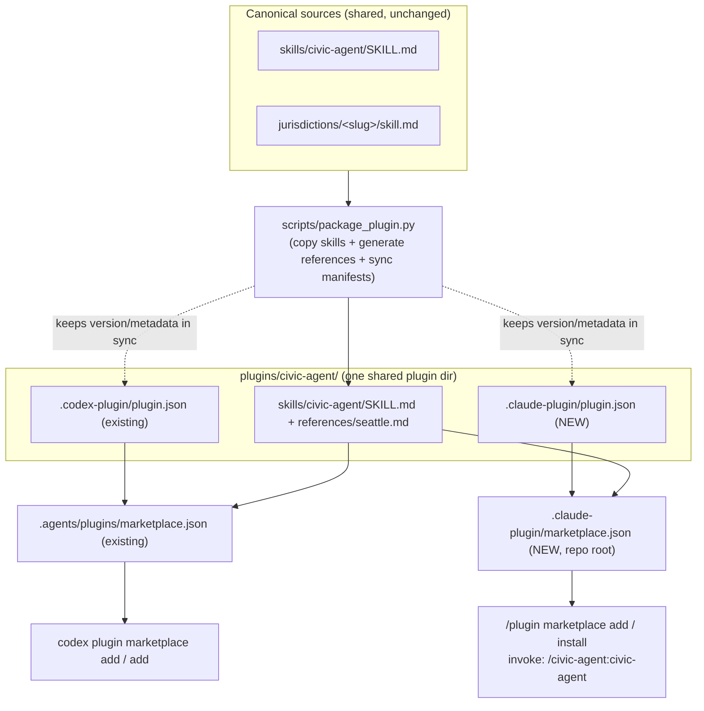

# feat: Add Claude Code plugin distribution support

> **Post-implementation revision.** A follow-up requirement — show the bare `/civic-agent` in Claude Code's command picker, not the namespaced `/civic-agent:civic-agent` — was resolved by adding an **`argument-hint`** to the router `SKILL.md`. Claude Code treats a skill that declares `argument-hint` as a command and shows it un-prefixed in the picker; skills without it are shown namespaced (confirmed against `compound-engineering`'s `/ce-plan` (has `argument-hint`, bare) vs `/ce-commit` and `/superpowers:brainstorming` (no `argument-hint`, namespaced)). The plugin name does **not** affect this. KTD1 (one shared plugin directory) holds: `plugins/civic-agent/` carries both `.codex-plugin/plugin.json` and the generated `.claude-plugin/plugin.json` (both named `civic-agent`) over one shared `skills/civic-agent/` tree; install id `civic-agent@civic-agent`. (Two interim attempts — a separate `plugins/civic-agent-cc/` root-`SKILL.md`, then renaming the plugin to `civic-data` — were both based on wrong premises about Claude Code's picker and were reverted.) See `docs/architecture.md` and the [[claude-code-plugin-command-naming]] note.

## Summary

Civic Agent currently distributes as a Codex plugin: canonical sources (`skills/civic-agent/SKILL.md` router + `jurisdictions/<slug>/skill.md`) are assembled by `scripts/package_plugin.py` into `plugins/civic-agent/` with a `.codex-plugin/plugin.json` manifest, and `.agents/plugins/marketplace.json` is the Codex catalog.

This plan adds **Claude Code** as a second distribution target alongside Codex, without changing skill behavior or the Codex flow. The key enabling fact: Claude Code's expected plugin layout — `<plugin>/skills/<name>/SKILL.md` plus bundled `references/` — is *exactly what the Codex packaging already produces*. So the skill content ports with zero changes. The work is manifest/catalog plumbing, keeping the new artifacts generated/synced from the same canonical sources, validation, and docs.

After this lands, a Claude Code user runs `/plugin marketplace add pejmanjohn/civic-agent` then `/plugin install civic-agent@civic-agent`, and invokes the router as `/civic-agent:civic-agent` — getting the same routed Seattle budget behavior Codex users get.

---

## Problem Frame

The repo packages one plugin for one ecosystem (Codex). Claude Code uses a different — but structurally compatible — plugin system with its own two required files in fixed locations:

- A **marketplace catalog** at the repo root: `.claude-plugin/marketplace.json` (Codex's lives at `.agents/plugins/marketplace.json`).
- A **plugin manifest** inside the plugin: `<plugin>/.claude-plugin/plugin.json` (Codex's lives at `<plugin>/.codex-plugin/plugin.json`).

Neither location collides with the existing Codex files, so both ecosystems can be served from one repo and one plugin directory. The challenge is not technical compatibility — it's adding the two manifests cleanly, keeping them from drifting away from the canonical sources and the Codex manifest, and proving the result installs and routes correctly.

---

## Requirements

- R1. A Claude Code user can add the marketplace from the GitHub repo (`/plugin marketplace add pejmanjohn/civic-agent`) and install the plugin (`/plugin install civic-agent@civic-agent`).
- R2. The installed plugin exposes the `civic-agent` router skill, invokable as `/civic-agent:civic-agent`, with the same routing behavior as the Codex build.
- R3. The bundled Seattle reference resolves identically inside the Claude Code install via the skill-relative path `references/seattle.md`.
- R4. The Claude Code artifacts derive from the same canonical sources as the Codex package, and shared metadata (version, description, author) stays in sync with the Codex manifest — no behavior or metadata divergence.
- R5. Both the marketplace and the plugin pass `claude plugin validate`.
- R6. The existing Codex distribution (`.agents/plugins/marketplace.json`, `.codex-plugin/plugin.json`, `codex plugin ...`) continues to work unchanged.
- R7. Documentation describes the Claude Code add / install / invoke flow alongside the existing Codex instructions.

---

## Key Technical Decisions

- KTD1: **Reuse one plugin directory** with parallel `.codex-plugin/plugin.json` and `.claude-plugin/plugin.json` manifests inside `plugins/civic-agent/`, sharing the same `skills/` tree (user-confirmed). The skill content is identical for both ecosystems, so duplicating into a second plugin tree would create a sync liability for no benefit.
- KTD2: **Two marketplace catalogs in their platform-mandated locations** — Claude Code's `.claude-plugin/marketplace.json` at the repo root and Codex's existing `.agents/plugins/marketplace.json`. Each platform hardcodes its catalog path; they coexist without conflict.
- KTD3: **Relative-path plugin source** (`"source": "./plugins/civic-agent"`) in the Claude Code marketplace entry, mirroring the Codex `local` source. This resolves correctly when users add the marketplace via git shorthand (`pejmanjohn/civic-agent`), which is the documented flow. Caveat: relative-path sources do **not** resolve if a user adds the marketplace by a raw URL to `marketplace.json` — see Risks.
- KTD4: **Version lives in `plugin.json`, never in the marketplace entry**, bumped per release (user-confirmed). Declaring it in both `plugin.json` and the marketplace entry is a documented footgun (the manifest value silently wins), so the marketplace catalog omits `version` entirely. The single editable version is the **base semver in the Codex `.codex-plugin/plugin.json`** (the part before `+codex.<stamp>`); the Claude `plugin.json` `version` is *generated* from that base by the packaging script (U3), not hand-edited. The Codex-style `+codex.<timestamp>` cachebuster is Codex-only — the Claude manifest carries the plain base semver (`0.1.0`), which Claude Code uses for update detection.
- KTD5: **Skill-only plugin; rely on convention-based skill discovery.** Claude Code auto-discovers `skills/<name>/SKILL.md`, so the manifest does not need to declare component paths. The Codex `skills/civic-agent/agents/openai.yaml` is inert for Claude Code (it is Codex composer metadata, not a Claude agent file) and is left untouched.
- KTD6: **Treat the hand-authored Codex `.codex-plugin/plugin.json` as the metadata source-of-truth** and have `package_plugin.py` *generate* the Claude `.claude-plugin/plugin.json` from it (drop the Codex `interface` block, strip the `+codex.<stamp>` version suffix). There is no pre-existing shared metadata dict in the script today, so this introduces a generator, not a refactor. Generating (rather than independently hand-maintaining) the Claude manifest is what keeps the two from drifting, and lets `--check` detect a stale Claude manifest. This preserves R6: the script reads the Codex manifest as input and does not rewrite its metadata.

---

## High-Level Technical Design

One canonical source set fans out into two distribution front-ends. The Codex path (left) already exists; this plan adds the Claude Code path (right). Everything above the dashed line is shared and unchanged; everything new is on the Claude Code branch plus the sync glue in the packaging script.



The diagram is directional guidance for reviewers, not an implementation specification.

---

## Output Structure

New files are marked `NEW`; everything else already exists and is unchanged.

```text
civic-agent/
  .claude-plugin/
    marketplace.json              # NEW — Claude Code marketplace catalog (repo root)
  .agents/plugins/
    marketplace.json              # existing — Codex catalog (untouched)
  plugins/civic-agent/
    .claude-plugin/
      plugin.json                 # NEW — Claude Code plugin manifest
    .codex-plugin/
      plugin.json                 # existing — Codex manifest (untouched)
    assets/icon.png               # existing
    skills/civic-agent/
      SKILL.md                    # existing/shared — minor parity wording (U4)
      references/seattle.md       # existing/shared — bundled jurisdiction reference
      agents/openai.yaml          # existing — Codex-only, inert for Claude Code
  scripts/
    package_plugin.py             # modified — manifest sync + --check coverage (U3)
  README.md                       # modified — Claude Code install section (U4)
  docs/
    architecture.md               # modified — dual-ecosystem packaging (U4)
```

The tree is a scope declaration of the expected shape; per-unit `Files` sections remain authoritative.

---

## Implementation Units

### U1. Add the Claude Code plugin manifest

- **Goal:** Create the Claude Code manifest that makes `plugins/civic-agent/` loadable as a Claude Code plugin.
- **Requirements:** R2, R4, R5.
- **Dependencies:** none.
- **Files:**
  - `plugins/civic-agent/.claude-plugin/plugin.json` (create)
- **Approach:** Write a clean Claude Code manifest — *not* a copy of the Codex `.codex-plugin/plugin.json`, which carries a Codex-specific `interface` block (composerIcon, brandColor, defaultPrompt, capabilities) that Claude Code does not consume. Include the fields Claude Code's plugin manifest schema recognizes, sourced from the existing Codex manifest so they match:
  - `name`: `civic-agent`
  - `description`: same one-line description as the Codex manifest
  - `version`: `0.1.0` — **generated** by the packaging script from the Codex manifest's base semver (U3, KTD4), not hand-edited. The directional JSON below shows the resulting value, not a value to type by hand.
  - `author`: `{ name, email, url }` from the Codex manifest
  - `homepage`, `repository`, `license`, `keywords`: carried from the Codex manifest
  - Optionally `displayName: "Civic Agent"` — note this field requires Claude Code v2.1.143+, so treat it as nice-to-have, not load-bearing.
  - Do **not** declare `skills`/`commands`/`agents` paths — Claude Code auto-discovers `skills/civic-agent/SKILL.md` by convention (KTD5).
- **Technical design (directional, not final JSON):**

  ```json
  {
    "name": "civic-agent",
    "description": "Analyze civic budget and public finance data through routed jurisdiction skills.",
    "version": "0.1.0",
    "author": { "name": "Pejman Pour-Moezzi", "email": "pejman.pourmoezzi@gmail.com", "url": "https://github.com/pejmanjohn" },
    "homepage": "https://github.com/pejmanjohn/civic-agent",
    "repository": "https://github.com/pejmanjohn/civic-agent",
    "license": "MIT",
    "keywords": ["civic-agent", "budget", "public-finance", "civic-data", "seattle", "washington", "socrata"]
  }
  ```

- **Patterns to follow:** Field values mirror `plugins/civic-agent/.codex-plugin/plugin.json`; only the schema shape differs (drop the Codex `interface` block, drop the `+codex.<timestamp>` build suffix from `version`).
- **Test scenarios:** Validated in U5 via `claude plugin validate ./plugins/civic-agent`. `Test expectation: none -- declarative manifest with no behavior; correctness is asserted by the validator and the U5 install smoke test.`
- **Verification:** `claude plugin validate ./plugins/civic-agent` reports no schema errors; the manifest parses as valid JSON.

### U2. Add the Claude Code marketplace catalog

- **Goal:** Create the repo-root catalog that lets Claude Code discover and install the plugin.
- **Requirements:** R1, R5.
- **Dependencies:** U1 (the catalog references the plugin the manifest defines).
- **Files:**
  - `.claude-plugin/marketplace.json` (create)
- **Approach:** Write a marketplace catalog with the three required pieces — `name`, `owner`, `plugins` — plus light discovery metadata:
  - `name`: `civic-agent` (kebab-case; not on the reserved list; yields `/plugin install civic-agent@civic-agent`, mirroring the Codex `civic-agent@civic-agent` identity).
  - `owner`: `{ "name": "Pejman Pour-Moezzi", "email": "pejman.pourmoezzi@gmail.com" }`.
  - `description`: brief marketplace description (suppresses the validator's "no description" warning).
  - `plugins[0]`: `{ "name": "civic-agent", "source": "./plugins/civic-agent", "description": ..., "category": "Analytics", "keywords": [...] }`.
  - Do **not** set `version` in the plugin entry — `plugin.json` owns the version (KTD4).
- **Technical design (directional):**

  ```json
  {
    "name": "civic-agent",
    "owner": { "name": "Pejman Pour-Moezzi", "email": "pejman.pourmoezzi@gmail.com" },
    "description": "Routed civic budget and public-finance skills, starting with Seattle.",
    "plugins": [
      {
        "name": "civic-agent",
        "source": "./plugins/civic-agent",
        "description": "Analyze civic budgets through routed jurisdiction skills.",
        "category": "Analytics"
      }
    ]
  }
  ```

- **Patterns to follow:** Keep the same plugin *identity* as `.agents/plugins/marketplace.json` (same `name`, same target path), but note the schemas differ in shape: the Codex entry uses a structured `source` object (`{ "source": "local", "path": "./plugins/civic-agent" }`) while Claude Code expects a plain relative string (`"source": "./plugins/civic-agent"`). Mirror the intent and target, not the JSON structure.
- **Test scenarios:** Validated in U5 via `claude plugin validate .`. `Test expectation: none -- declarative catalog; correctness is asserted by the validator (schema, duplicate-name, path-traversal, version-mismatch checks) and the U5 install smoke test.`
- **Verification:** `claude plugin validate .` reports no errors and no `Path contains ".."` / duplicate-name issues; the relative source resolves to `plugins/civic-agent/`.

### U3. Sync both manifests through the packaging script

- **Goal:** Generate the Claude manifest from the Codex manifest so the two cannot drift, and bring the generated manifest under `--check`.
- **Requirements:** R4, R6.
- **Dependencies:** U1.
- **Files:**
  - `scripts/package_plugin.py` (modify)
- **Approach (read the current script state first):** Today `collect_outputs()` returns only the copied skill files (`SKILL.md`, `agents/openai.yaml`) and the generated `references/<jurisdiction>.md`. The Codex `.codex-plugin/plugin.json` enters `collect_outputs` **only** when `--update-cachebuster` is passed, where the script reads it, rewrites its `version` field via `SEMVER_WITH_BUILD_RE`, and writes it back. Two consequences shape this unit:
  - There is **no existing shared-metadata dict** to derive from — the Codex manifest is the hand-authored source of truth for `description`, `author`, `homepage`, `repository`, `license`, `keywords`, and the base `version`. So this unit *introduces a generator*, it does not refactor an existing one.
  - `--check` today compares only the paths in `collect_outputs()` against disk, so it **never inspects any manifest**. Making `--check` catch a stale Claude manifest therefore requires adding the Claude manifest to `collect_outputs()` on every run (not behind a flag) — new behavior, not an additive tweak.

  Concrete shape:
  - Add a `CLAUDE_MANIFEST_PATH` constant for `plugins/civic-agent/.claude-plugin/plugin.json`.
  - Add a generator that reads the Codex `.codex-plugin/plugin.json`, drops its `interface` block, strips the `+codex.<stamp>` suffix off `version` (reuse `SEMVER_WITH_BUILD_RE`'s base group so the Claude manifest gets plain `0.1.0`), and emits the Claude manifest JSON. Include this output in `collect_outputs()` on every run so both write and `--check` cover it.
  - Keep `--update-cachebuster` **Codex-only** — it stamps the Codex `version` only; the Claude manifest always carries the stripped base semver (KTD4, KTD6).
  - Decide and state the Codex-manifest `--check` posture: because the committed Codex `version` already carries `+codex.<stamp>`, do **not** bring the Codex manifest under content `--check` (a cachebusted value would always report drift). `--check` covers the Claude manifest (whose generated content is stable) and the skill/reference files; the Codex manifest stays writer-only under `--update-cachebuster`.
- **Patterns to follow:** The existing `collect_outputs()` / `MANIFEST_PATH` / `SEMVER_WITH_BUILD_RE` / `read_text()` / `--check` structure in `scripts/package_plugin.py` — extend the same shape rather than introducing a parallel mechanism.
- **Execution note:** Characterize current behavior first — run `python3 scripts/package_plugin.py --check` on a clean tree and confirm today's pass/fail state before changing anything, so the new manifest-generation-and-check logic is layered on a known baseline and the Codex path stays green.
- **Test scenarios:** The script's `--check` mode is the test harness; verify at the CLI:
  - Happy path: on a clean, freshly-packaged tree, `python3 scripts/package_plugin.py --check` exits 0 and reports the package is current.
  - Drift detection: hand-edit `version` (or `description`) in the generated `plugins/civic-agent/.claude-plugin/plugin.json` to a stale value, run `--check`, and confirm it exits non-zero and names the Claude manifest as out of date.
  - Generate-on-write: run `python3 scripts/package_plugin.py` (no flags) against a tree whose Claude manifest was deleted or staled, and confirm it is (re)written from the Codex manifest with the plain base version (`0.1.0`, no `+codex.<stamp>` suffix) and no `interface` block.
  - Metadata propagation: change a shared field (e.g. `description`) in the Codex `.codex-plugin/plugin.json`, run the script, and confirm the regenerated Claude manifest reflects the new value.
  - Cachebuster isolation: run `python3 scripts/package_plugin.py --update-cachebuster` and confirm only the Codex manifest gains/updates the `+codex.<stamp>` suffix while the Claude manifest version stays the plain base semver.
- **Verification:** A clean tree passes `--check`; a hand-staled Claude manifest fails it; the Claude manifest is generated from the Codex manifest with the suffix stripped and the `interface` block removed; the Codex manifest is not brought under content `--check`.

### U4. Document the Claude Code distribution flow

- **Goal:** Give users the Claude Code add/install/invoke instructions and update the architecture/router notes to reflect two ecosystems.
- **Requirements:** R7, R2, R3.
- **Dependencies:** U1, U2 (docs describe the artifacts those units create).
- **Files:**
  - `README.md` (modify)
  - `docs/architecture.md` (modify)
  - `skills/civic-agent/SKILL.md` (modify — parity wording)
  - `plugins/civic-agent/skills/civic-agent/SKILL.md` (regenerated copy — keep consistent via the packaging script, do not hand-edit)
- **Approach:**
  - `README.md`: add a "Claude Code Plugin Install" section next to the existing Codex one:

    ```text
    /plugin marketplace add pejmanjohn/civic-agent
    /plugin install civic-agent@civic-agent
    ```

    Document that the router is invoked as `/civic-agent:civic-agent` (Claude Code namespaces plugin skills as `/<plugin>:<skill>`), and add the `.claude-plugin/marketplace.json` + `.claude-plugin/plugin.json` entries to the "Repo Shape" tree. Mention `claude plugin validate .` for local testing. Note that the `owner/repo` shorthand resolves the repo's default branch (`main`), so no ref pin is needed — unlike the Codex flow, which documents an explicit `--ref main` (append `@main` if a user wants to pin it). U5 confirms the unpinned add actually resolves the plugin.
  - `docs/architecture.md`: under the marketplace discussion, document that the repo now serves two catalogs from one canonical source — Codex at `.agents/plugins/marketplace.json`, Claude Code at `.claude-plugin/marketplace.json` — and one shared plugin directory with two manifests.
  - `skills/civic-agent/SKILL.md`: generalize the Seattle route note from "If Civic Agent is installed as a Codex plugin, use the bundled reference `references/seattle.md`" to cover any packaged plugin (Codex **or** Claude Code), since the bundled `references/seattle.md` path is identical in both installs (R3). Edit the **canonical** source file; the packaged copy under `plugins/civic-agent/skills/civic-agent/SKILL.md` is regenerated by `scripts/package_plugin.py`, not hand-edited.
- **Patterns to follow:** Match the existing README "Codex Plugin Install" / "Packaging" section voice and the architecture.md structure; keep the fresh-agent prompt surface unchanged.
- **Test scenarios:** `Test expectation: none -- documentation and a behavior-neutral wording change. The packaged-copy regeneration is exercised by U3's --check; the route still points at references/seattle.md, so routing behavior is unchanged and is covered by U5's smoke test.`
- **Verification:** README shows working Claude Code add/install/invoke commands; the repo-shape tree includes the two new files; `package_plugin.py --check` passes after regenerating the packaged SKILL.md copy (no manual drift between canonical and packaged router).

### U5. Validate and locally smoke-test the install

- **Goal:** Prove the marketplace and plugin validate and that a real local install routes a Seattle question through the bundled reference.
- **Requirements:** R1, R2, R3, R5, R6.
- **Dependencies:** U1, U2, U3, U4.
- **Files:** none (verification unit; no source changes).
- **Approach:** Gate on `claude` CLI availability (`command -v claude`). If present, run the validation and a local install end-to-end; if absent, record the exact manual steps in the PR/verification notes so a maintainer with the CLI can reproduce.
  - Validate the marketplace: `claude plugin validate .`
  - Validate the plugin: `claude plugin validate ./plugins/civic-agent`
  - Local install from the working copy: `/plugin marketplace add ./` then `/plugin install civic-agent@civic-agent`.
  - Invoke `/civic-agent:civic-agent` with a Seattle prompt (e.g. "Which Seattle departments grew the most from 2018 to 2026?") and confirm the agent reads `references/seattle.md` and returns a source-backed answer with grain/caveats.
  - Confirm the Codex path is unbroken: `python3 scripts/package_plugin.py --check` passes and `.agents/plugins/marketplace.json` / `.codex-plugin/plugin.json` are unchanged in the diff (R6).
- **Patterns to follow:** The "Test locally before distribution" and "Validation and testing" flows from the Claude Code marketplace docs.
- **Test scenarios:**
  - Marketplace validation: `claude plugin validate .` exits clean (no schema, duplicate-name, or path-traversal errors).
  - Plugin validation: `claude plugin validate ./plugins/civic-agent` exits clean (manifest + SKILL.md frontmatter parse).
  - Install + discovery: after `/plugin install civic-agent@civic-agent`, the `civic-agent` skill is listed and `/civic-agent:civic-agent` is invokable.
  - Routing (integration): invoking the skill on a Seattle question causes it to read the bundled `references/seattle.md` and answer with the Seattle dataset's source, grain, and caveats — the same behavior as the Codex install (Covers R2, R3).
  - Regression: the Codex artifacts are untouched in the diff and `package_plugin.py --check` passes (Covers R6).
  - CLI-absent fallback: if `claude` is not installed, the unit completes by documenting the manual validation/install steps rather than silently skipping them.
- **Verification:** Both `validate` commands pass; the local install exposes and routes the skill correctly; the Seattle answer is source-backed via the bundled reference; the Codex distribution is provably unchanged.

---

## Scope Boundaries

### In scope

- Claude Code marketplace catalog (`.claude-plugin/marketplace.json`).
- Claude Code plugin manifest (`.claude-plugin/plugin.json`).
- Packaging-script sync so both manifests stay consistent with canonical sources.
- Validation and a local install smoke test.
- Install/architecture documentation for the Claude Code flow.

### Deferred to Follow-Up Work

- CI automation that runs `claude plugin validate` and `package_plugin.py --check` on every push.
- Release-channel setup (separate `stable`/`latest` marketplaces pinned to different refs).
- Publishing/listing on the public Claude.ai plugin marketplace registry (beyond self-hosting via the GitHub repo).

### Outside this product's identity

- New jurisdictions or datasets (this plan is distribution-only; Seattle remains the sole source).
- Adding hooks, MCP servers, LSP servers, or Claude Code agent files — the plugin stays skill-only.
- Any change to the skill's routing logic or answer behavior.

---

## Risks & Dependencies

- **Relative-path source + URL-based add.** A relative `source` (`./plugins/civic-agent`) only resolves when the marketplace is added via git (the documented `pejmanjohn/civic-agent` shorthand). If a user instead adds a raw URL to `marketplace.json`, the plugin path fails. *Mitigation:* document the git add form as the supported path; if URL-based distribution becomes a requirement later, switch the entry to a `github` source. Tracked, low likelihood given the documented flow.
- **`/civic-agent:civic-agent` double-name.** Claude Code namespaces plugin skills as `/<plugin>:<skill>`, so the invocation repeats the name. *Mitigation:* this is expected behavior, not a defect; document it so users aren't surprised. Renaming the skill purely for cosmetics would break parity with the Codex identity, so keep it.
- **Manifest drift between ecosystems.** Two manifests holding the same metadata can diverge. *Mitigation:* U3 drives shared fields from one source and `--check` fails on divergence.
- **`claude` CLI not available in the dev environment.** Validation and the install smoke test depend on it. *Mitigation:* U5 gates on `command -v claude` and falls back to documented manual steps.
- **Version-gated manifest fields.** `displayName` requires Claude Code v2.1.143+. *Mitigation:* treat it as optional (U1); the plugin loads and functions without it on older clients.
- **Double-version footgun.** Declaring `version` in both `plugin.json` and the marketplace entry causes the manifest value to win silently and can mask intended updates. *Mitigation:* KTD4 — version lives only in `plugin.json`.
