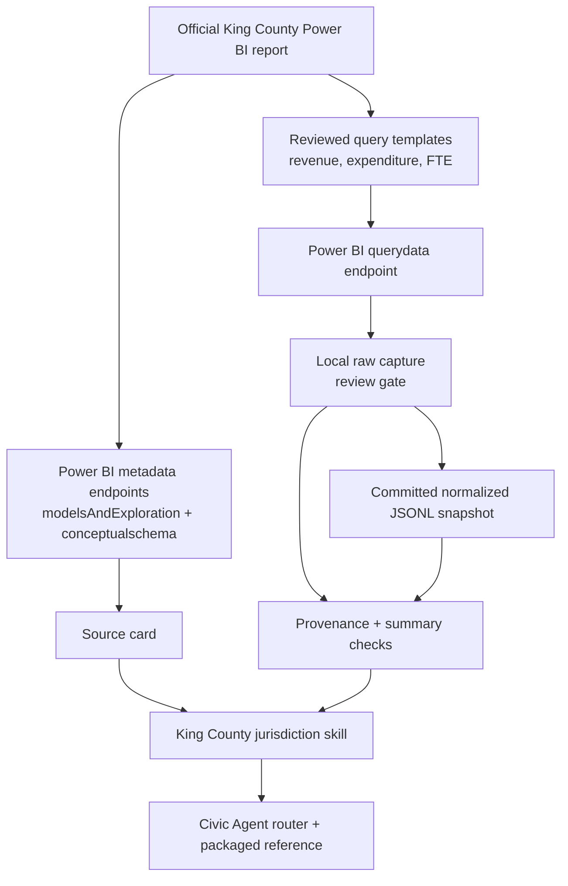

# feat: Add King County Power BI Budget Source

## Summary

Add King County as Civic Agent's second source by treating its official Open Budget Power BI dashboard as a replayable, snapshot-backed source. The implementation should create a `king_county` jurisdiction, source card, source-specific Power BI extractor, checked-in normalized snapshot with provenance, answer skill, and worked demo while preserving the existing jurisdiction-first folder structure.

---

## Problem Frame

Seattle proved the clean Socrata path. King County is the next useful contrast: an official public dashboard served through Power BI Gov that exposes revenue, expenditure, FTE, capital, FAQ, and population entities. Browser inspection showed the report can be queried through public Power BI `querydata`, `modelsAndExploration`, and `conceptualschema` endpoints, but those endpoints are undocumented report internals. That makes a live-only skill too fragile for dependable civic answers.

This plan follows the source #2 guidance from `docs/brainstorms/2026-06-04-contribution-workflow-requirements.md`: add one narrow, source-backed jurisdiction source before building contributor machinery or broad schemas. The initial King County scope should support source-backed revenue and expenditure answers by year and department, include FTE only if the captured query remains stable without broader reverse engineering, and always include explicit caveats and reproducible snapshots.

---

## Requirements

**Source Trust**

- R1. King County must be added under the existing jurisdiction-first layout, with canonical files under `jurisdictions/king_county/`.
- R2. The King County source card must identify the official dashboard, Power BI report URL, resource key, model id, dataset/db id, observed model refresh time, supported question patterns, unsupported claims, validation checks, and caveats.
- R3. The source must support replayable extraction from Power BI public report endpoints without requiring a resident browser at answer time.
- R4. The initial checked-in data must include provenance that lets a reader connect normalized rows back to the Power BI report, query template, visual/source context, model refresh timestamp, extraction timestamp, template hashes, response checksums, and validation totals.
- R5. King County answers must include compact source traces: source, grain, measure, filters/query logic, validation check or row count, and caveats.

**Initial Data Coverage**

- R6. The initial normalized snapshot must cover King County budgeted revenue and budgeted expenditure values by year for the dashboard's available year range.
- R7. The initial normalized snapshot must cover department-level revenue and expenditure rows for at least the available adopted/proposed budget years exposed by the reusable department query.
- R8. The initial normalized snapshot should cover FTE only if the captured query payload exposes stable year and department FTE without additional reverse engineering; otherwise FTE is deferred and marked unsupported for the first King County source slice.
- R9. The source must not imply broad King County public-finance coverage beyond the extracted dashboard surfaces.

**Repo Integration**

- R10. The installable Civic Agent router must route King County budget questions to the King County jurisdiction skill.
- R11. The packaged plugin reference for King County must be generated from the canonical jurisdiction skill, matching the existing Seattle packaging pattern.
- R12. README, architecture, plan, and prompt docs must describe King County as source #2 without introducing generic contributor scaffolding or cross-jurisdiction comparison promises.

---

## Key Technical Decisions

- KTD1. **Snapshot-backed Power BI source:** Use the public Power BI endpoints as the extraction mechanism, but make checked-in snapshots the dependable answer source. The report is official, but the query protocol is undocumented and can change.
- KTD2. **Source-specific extractor, not a framework:** Add a King County extractor that understands this report's resource key, model metadata, query templates, and response shape. Do not create a generic Power BI adapter, shared adapter package, plugin hook, registry, or abstraction named as if it supports arbitrary Power BI reports.
- KTD3. **Query templates are replay artifacts:** Store reviewed Power BI semantic query payloads as source-adjacent replay artifacts, not hardcoded prose in the skill. They are the reproducible bridge between the dashboard visuals and the normalized snapshot.
- KTD4. **Start with high-confidence dashboard surfaces:** Support overview year totals and department revenue/expenditure first. Include FTE only if the captured payload remains stable. Defer the capital map, capital project decision table, FAQ table, population normalization, and deeper division/type drill-downs until the extractor and source card are stable.
- KTD5. **Version snapshots by model refresh, validate by hashes:** Use the Power BI model's observed `LastRefreshTime` as the data-version directory when available, but validate snapshot identity through model metadata, query-template hashes, response checksums, and row/total checks recorded in provenance.
- KTD6. **Validate against visible dashboard checks:** Use known FY2026 totals, year counts, and department row counts as validation checks. These are strong enough to catch query/template drift without pretending to be a full eval runner.
- KTD7. **No cross-jurisdiction normalization yet:** King County should be queryable as its own source. Seattle-vs-King-County comparisons remain unsupported until accounting definitions and normalized dimensions are explicit.

---

## High-Level Technical Design



The extractor uses metadata endpoints to verify it is still talking to the expected model, then replays reviewed query templates through `querydata`. Normalized rows power demos and agent instructions. Provenance records enough context to reproduce or invalidate the snapshot later. Raw live responses are local/debug artifacts by default; commit only sanitized fixture responses and compact committed outputs unless a raw payload passes an explicit size and content review gate.

---

## Output Structure

```text
jurisdictions/
  king_county/
    README.md
    skill.md
    data/
      README.md
      open-budget-dashboard/
        query_templates/
          overview-by-year.query.json
          department-revenue-expenditure-by-year.query.json
          department-fte-by-year.query.json
        2026-04-01/
          normalized/
            overview-by-year.jsonl
            department-revenue-expenditure-by-year.jsonl
            department-fte-by-year.jsonl
          summary.json
          provenance.json
    scripts/
      extract_open_budget.py
    sources/
      open-budget-dashboard.source.json
docs/
  king-county-demo.md
tests/
  fixtures/
    king_county/
      overview-by-year.response.json
      department-revenue-expenditure-by-year.response.json
      conceptualschema-sample.json
      fte-by-year.response.json
  test_king_county_powerbi_extract.py
```

The exact snapshot version directory should be derived from the Power BI model refresh date discovered during implementation. If the model refresh differs from the planning evidence, use the discovered refresh date and record the planning evidence as superseded in provenance. King County intentionally uses a multi-artifact snapshot directory because one Power BI report produces several normalized tables.

---

## Implementation Units

### U1. King County Source Card And Jurisdiction Skeleton

- **Goal:** Establish the canonical King County jurisdiction folder and source metadata without adding extraction behavior yet.
- **Requirements:** R1, R2, R9
- **Dependencies:** None
- **Files:**
  - `jurisdictions/king_county/README.md`
  - `jurisdictions/king_county/data/README.md`
  - `jurisdictions/king_county/sources/open-budget-dashboard.source.json`
- **Approach:** Mirror the Seattle folder pattern while documenting that this is a Power BI snapshot-backed source, not a clean live API. The source card should include the public report URL, official dashboard page URL, Power BI resource key, API host, metadata endpoints, query endpoint, model id, dataset/db id, observed `LastRefreshTime`, known entity names, primary measures, safe answer patterns, unsupported claims, validation checks, and caveats.
- **Patterns to follow:** `jurisdictions/seattle/README.md`, `jurisdictions/seattle/data/README.md`, `jurisdictions/seattle/sources/operating-budget.source.json`, `docs/architecture.md`.
- **Test scenarios:**
  - Happy path: the source card is valid JSON and includes `safe_answer_patterns`, `not_supported_by_this_source`, `validation_checks`, and `caveats`.
  - Edge case: unsupported claims explicitly include actual spending, payment/checkbook transactions, staffing rosters, broad King County policy claims, and Seattle/Washington-state analysis.
  - Integration: a reviewer can locate the official dashboard and Power BI report from the source card alone.
- **Verification:** Source metadata is machine-readable, mirrors existing source-card style, and clearly scopes what the King County source can and cannot answer.

### U2. Power BI Query Templates And Extractor

- **Goal:** Add a source-specific extractor that replays reviewed Power BI query templates, decodes responses, and writes raw/normalized/provenance artifacts.
- **Requirements:** R3, R4, R6, R7, R8
- **Dependencies:** U1
- **Files:**
  - `jurisdictions/king_county/scripts/extract_open_budget.py`
  - `jurisdictions/king_county/data/open-budget-dashboard/query_templates/overview-by-year.query.json`
  - `jurisdictions/king_county/data/open-budget-dashboard/query_templates/department-revenue-expenditure-by-year.query.json`
  - `jurisdictions/king_county/data/open-budget-dashboard/query_templates/department-fte-by-year.query.json`
  - `tests/fixtures/king_county/overview-by-year.response.json`
  - `tests/fixtures/king_county/department-revenue-expenditure-by-year.response.json`
  - `tests/fixtures/king_county/conceptualschema-sample.json`
  - `tests/fixtures/king_county/fte-by-year.response.json`
  - `tests/test_king_county_powerbi_extract.py`
- **Approach:** Keep the extractor in the King County jurisdiction tree and use the Python standard library unless implementation shows a real dependency need. Limit the helper surface to report-specific functions such as `load_template`, `post_querydata`, `parse_dsr_table`, and `write_snapshot`. The extractor should fetch `modelsAndExploration` and `conceptualschema`, compare the discovered model/report context to source-card expectations, replay each query template through `querydata`, decompress gzip responses, parse this report's Power BI `dsr` payloads, and normalize rows. It must not introduce a generic Power BI adapter, reusable class hierarchy, source interface, registry, or cross-jurisdiction abstraction.
- **Execution note:** Add parser coverage before relying on live Power BI responses. Power BI's `dsr` row compression and nested hierarchy structures are easy to misread.
- **Technical design:** Directionally, the extractor has four boundaries: metadata verification, query-template rendering, raw response capture, and normalizer-specific row parsing. Keep those boundaries visible so tests can exercise parsing with fixtures without hitting the network.
- **Patterns to follow:** `scripts/package_plugin.py` for small standard-library Python style; `jurisdictions/seattle/data/README.md` for snapshot policy; the browser-sniff guidance from `cli-printing-press` for treating browser capture as discovery and replayability as the success bar.
- **Test scenarios:**
  - Happy path: a fixture response with FY2026 revenue total `8865634686` and expenditure total `8598795612` normalizes to explicit year/measure rows.
  - Happy path: a department revenue/expenditure fixture normalizes rows for DCHS, DNRP, Metro Transit, and the total row with expected numeric values.
  - Conditional path: an FTE fixture normalizes department-level FTE rows and total FTE only if the captured payload remains stable; otherwise the source marks FTE deferred.
  - Edge case: parser handles the compressed row shape present in this report's captured fixtures without claiming arbitrary Power BI support.
  - Error path: metadata model id or dataset/db id mismatch causes extraction to fail with a provenance-oriented message instead of silently writing a misleading snapshot.
  - Error path: HTTP failures, gzip decode failures, invalid JSON, or missing `results`/`dsr` fields stop before writing a partial normalized snapshot.
  - Integration: extractor can run against fixture data without network access and against live endpoints when explicitly requested by the implementer.
- **Verification:** Extractor tests prove the parser against fixtures, and a live extraction spike produces reviewed local captures, normalized rows, summary checks, and provenance in the expected directory shape.

### U3. Initial Snapshot, Raw Artifact Gate, And Validation Summary

- **Goal:** Commit a first King County snapshot for supported revenue and expenditure grains, with FTE included only if stable, while keeping raw Power BI payloads out of the repo unless explicitly reviewed.
- **Requirements:** R4, R6, R7, R8
- **Dependencies:** U2
- **Files:**
  - `jurisdictions/king_county/data/open-budget-dashboard/{model_refresh_date}/normalized/overview-by-year.jsonl`
  - `jurisdictions/king_county/data/open-budget-dashboard/{model_refresh_date}/normalized/department-revenue-expenditure-by-year.jsonl`
  - `jurisdictions/king_county/data/open-budget-dashboard/{model_refresh_date}/normalized/department-fte-by-year.jsonl`
  - `jurisdictions/king_county/data/open-budget-dashboard/{model_refresh_date}/summary.json`
  - `jurisdictions/king_county/data/open-budget-dashboard/{model_refresh_date}/provenance.json`
  - `.gitignore`
  - `tests/test_king_county_powerbi_extract.py`
- **Approach:** Run one live extraction spike before committing snapshot artifacts. Review raw payload size and content. Commit normalized JSONL, `summary.json`, `provenance.json`, query templates, and sanitized fixture responses. Commit raw live responses only if each payload is small, reviewed, and useful enough to justify repository storage; otherwise ignore local raw captures and store response checksums plus reproduction instructions in provenance. Use model refresh date for the version directory; provenance records extraction/access date, Power BI report URL, resource key, API host, model id, dataset/db id, report id, visual ids, query template names, template hashes, response checksums, row counts, validation totals, and source-card expected model metadata.
- **Patterns to follow:** Seattle source validation checks, `docs/seattle-demo.md` trace style, `docs/architecture.md` snapshot shape.
- **Test scenarios:**
  - Happy path: summary contains known year range, row counts, FY2026 revenue total, and FY2026 expenditure total.
  - Conditional path: summary contains FY2026 FTE totals only if FTE ships in the first source slice.
  - Edge case: if the dashboard exposes future budget years, summary records them as budget years without implying actual spending or actual revenue.
  - Error path: snapshot validation fails if normalized totals diverge from raw response totals.
  - Integration: source-card validation checks can be updated from the committed `summary.json` without hand-recomputing values.
- **Verification:** Snapshot files are compact enough for the repo, local raw captures are ignored unless explicitly reviewed, provenance fully explains how outputs were produced, and validation checks match the dashboard totals observed during extraction.

### U4. King County Jurisdiction Skill And Router Integration

- **Goal:** Teach Civic Agent how to answer supported King County questions using the source card and snapshot.
- **Requirements:** R5, R9, R10, R11
- **Dependencies:** U1, U3
- **Files:**
  - `jurisdictions/king_county/skill.md`
  - `skill.md`
  - `skills/civic-agent/SKILL.md`
- **Generated outputs:**
  - `plugins/civic-agent/skills/civic-agent/SKILL.md`
  - `plugins/civic-agent/skills/civic-agent/references/king_county.md`
  - `plugins/civic-agent/skills/civic-agent/references/seattle.md`
  - `plugins/civic-agent/skills/civic-agent/references/*.md`
- **Approach:** Create a King County skill that starts from the checked-in snapshot, not live Power BI calls, for normal agent answers. Include supported questions, source of truth, data grains, field meanings, validation checks, interpretation rules, and answer style. Update router instructions so King County budget/revenue/expenditure/FTE questions route to the new jurisdiction skill. Regenerate packaged references through the existing package script rather than editing generated files by hand.
- **Patterns to follow:** `jurisdictions/seattle/skill.md`, `skill.md` source registry style, `skills/civic-agent/SKILL.md`, `scripts/package_plugin.py`.
- **Test scenarios:**
  - Happy path: a King County revenue/expenditure question routes to `jurisdictions/king_county/skill.md` and answers from the snapshot with source trace fields.
  - Happy path: a King County FTE question uses budgeted FTE language and does not imply personnel roster or vacancies.
  - Edge case: a user asks for actual spending or actual revenue earned; the skill refuses or caveats clearly because the dashboard is authorized budget data.
  - Edge case: a user asks for Seattle or Washington-state analysis while in King County context; the router keeps jurisdictions separate.
  - Integration: package generation creates the King County packaged reference from the canonical skill file.
- **Verification:** Router and packaged plugin references are current after running the package script, generated plugin files are not hand-edited, and the King County skill's safe/unsupported boundaries match the source card.

### U5. Demo Answers And Documentation

- **Goal:** Make the King County source understandable to future users and implementers through worked examples and updated docs.
- **Requirements:** R5, R9, R12
- **Dependencies:** U3, U4
- **Files:**
  - `docs/king-county-demo.md`
  - `README.md`
  - `docs/architecture.md`
  - `docs/plan.md`
  - `examples/prompts.md`
- **Approach:** Add worked answers for the core supported questions: countywide budgeted revenue/expenditure by year, FY2026 department revenue/expenditure ranking, FTE only if it shipped in the source slice, and a caveated explanation of what the dashboard does not prove. Keep the demo in the same source-backed style as Seattle: conclusion, numbers, how to read this, trace, and caveats. Update repo docs to name King County as source #2 and explain snapshot-backed Power BI extraction without presenting it as a generic Power BI framework.
- **Patterns to follow:** `docs/seattle-demo.md`, README source list, `docs/architecture.md` source metadata and snapshot sections, `examples/prompts.md`.
- **Test scenarios:**
  - Happy path: demo answers cite King County source, snapshot version, grain, measure, filters/query logic, validation checks, and caveats.
  - Edge case: demo text distinguishes budgeted/authorized amounts from actual spending and actual revenue earned.
  - Edge case: docs do not imply cross-jurisdiction comparison support between Seattle and King County.
  - Integration: prompt examples include King County while preserving Seattle examples and Data Analytics chart handoff guidance.
- **Verification:** A future reader can understand what King County supports, how the data was extracted, and why snapshots are used without reading extractor code.

## Final Acceptance Checklist

- JSON source cards, query templates, summary, and provenance files parse.
- Extractor tests pass with sanitized fixtures and the committed snapshot summary matches expected validation checks.
- Provenance includes model metadata, extraction timestamp, query-template hashes, response checksums, row counts, validation totals, and reproduction instructions for any uncommitted raw captures.
- Package generation and `scripts/package_plugin.py --check` pass.
- Generated plugin references are current and no generated files were edited by hand.
- Docs and demo keep King County scoped to this dashboard source and do not introduce contributor machinery, a generic Power BI adapter, or cross-jurisdiction comparison support.

---

## Scope Boundaries

### In Scope

- One new `king_county` jurisdiction folder.
- One King County source card for the official Open Budget Power BI dashboard.
- A source-specific Power BI extraction script.
- Query templates for initial supported revenue, expenditure, and FTE grains.
- Checked-in normalized, summary, provenance, query-template, and sanitized fixture artifacts.
- A King County jurisdiction skill and packaged plugin reference.
- Worked demo answers and doc updates.

### Deferred to Follow-Up Work

- Capital map/project extraction from the `2025CIPDecision` and `LatitudeAndLongitude` entities.
- FAQ table extraction into reusable concept notes.
- Population-normalized per-capita analysis.
- Division-level and type-level drill-downs from the Revenue and Expenditure report pages if they require additional query templates.
- FTE if the captured FTE query is not stable enough for the first source slice.
- A generic Power BI source adapter shared across jurisdictions.
- Formal source-card schema, source-intake template, or contributor scaffolding.
- Cross-jurisdiction comparison between Seattle and King County.

### Outside This Source

- Actual spending, payments, checkbook transactions, invoices, or procurement activity.
- Actual revenue collected or earned during a budget period.
- Realtime county operations, service delivery, incidents, or performance data.
- Personnel rosters, vacancies, or employee-level staffing claims.
- Broad King County policy conclusions not directly supported by the dashboard rows.

---

## Risks And Dependencies

- **Power BI internals can change:** The public report endpoints are replayable today, but undocumented. Snapshot-backed answers and provenance reduce runtime fragility.
- **Model ids and query shapes can drift:** The extractor should verify model/report metadata before writing a snapshot and fail clearly on mismatch.
- **Power BI response encoding is non-obvious:** Responses are gzip-compressed `text/plain` and use `dsr` structures with row compression. Fixture tests are required before trusting normalized output.
- **Dashboard selection state can mislead manual inspection:** Report visuals preserve selections and page filters. Query-template extraction should rely on reviewed payloads and validation totals rather than visual screenshots alone.
- **Future budget years are budget data, not actuals:** The dashboard may expose 2027 values. Answer caveats must call them budgeted/authorized values.
- **Raw Power BI payloads can be noisy or too large:** Raw live responses may include opaque report internals. Commit sanitized fixture payloads by default; commit raw live responses only after size and content review.

---

## Documentation And Operational Notes

- Normal Civic Agent answers should use the checked-in snapshot, not live Power BI calls.
- The extractor should be rerun only when refreshing King County data or validating that the public report has changed.
- Provenance must record both model refresh time and extraction time; those are different facts.
- Local raw captures should be ignored unless a specific payload passes review and is intentionally committed.
- Source docs should explain that the dashboard is updated as budgets are passed and may lag adoption.
- Plugin package artifacts must remain generated from canonical jurisdiction files.

---

## Sources And Research

- Existing Civic Agent source pattern: `jurisdictions/seattle/skill.md`, `jurisdictions/seattle/sources/operating-budget.source.json`, `docs/seattle-demo.md`.
- Source #2 guidance: `docs/brainstorms/2026-06-04-contribution-workflow-requirements.md`.
- Packaging pattern: `scripts/package_plugin.py`, `plugins/civic-agent/skills/civic-agent/references/seattle.md`.
- Official King County dashboard: `https://kingcounty.gov/en/dept/executive/governance-leadership/performance-strategy-budget/budget/budget-dashboard`.
- Power BI report: `https://app.powerbigov.us/view?r=eyJrIjoiOTNmYzYwMDEtNWM5ZC00YjllLThlNzAtZDc1OGRjNzA4MmEwIiwidCI6ImJhZTUwNTlhLTc2ZjAtNDlkNy05OTk2LTcyZGZlOTVkNjljNyJ9`.
- King County dashboard glossary and FAQ explain revenue, expenditures, FTE, General Fund, negative expenditures, dashboard update timing, and the caveat that the dashboard shows authorized budget data rather than actual spending or revenue earned.
- Planning inspection proved replayability for Power BI `querydata` POSTs and direct access to `modelsAndExploration` and `conceptualschema`. Observed model metadata included model id `897134`, dataset/db id `e6354f5d-a44d-4c75-ab7a-a2293b56b83b`, and model refresh time `2026-04-01T21:37:44.693`.
- `cli-printing-press` browser-sniff guidance shaped the extraction posture: browser capture is discovery input, and replayability is the success criterion.
