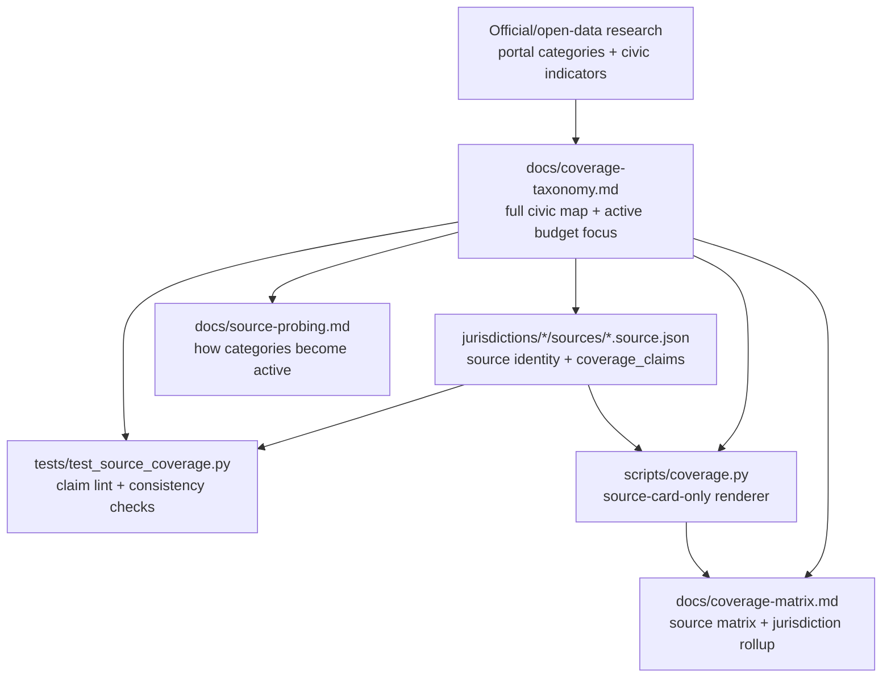

# feat: Add Civic Coverage Taxonomy And Source Claims

## Summary

Add a research-backed coverage framework that separates Civic Agent's long-term civic data map from its current budget-focused implementation. The work defines a top-down taxonomy of citizen-relevant civic data categories, keeps budget/public-finance as the current active focus, backfills compact source-level `coverage_claims`, and renders source and jurisdiction coverage views that show what is supported, what is missing, and which additional sources would be needed.

---

## Problem Frame

Civic Agent now has three production sources: Seattle's clean Socrata operating budget dataset, King County's snapshot-backed Open Budget Dashboard, and Washington's snapshot-backed Fiscal WA operating budget report. The repo has enough variety to stop treating Seattle as the only source-card exemplar, but not enough evidence to build a normalized cross-jurisdiction civic data model.

The user need has two layers. First, Civic Agent needs a top-down point of view on the civic data categories that residents commonly want to understand and that governments commonly publish: budgets, spending, revenue, staffing, public safety, transportation, housing/permitting, demographics, economic context, health and human services, environment, service delivery, performance, governance, and elections. Second, the repo needs a practical way to assess current source coverage against that map without pretending that one budget source covers an entire jurisdiction.

External research supports this split. City open data portals commonly expose broad categories such as finance/budget, public safety, transportation, demographics, health/human services, planning/zoning, environment, parks, real estate/land records, and elections. Performance-data programs such as What Works Cities frame civic data around service delivery, budget allocation, evaluation, resident engagement, and performance improvement. Indicator projects such as City Health Dashboard show that citizen-relevant metrics extend beyond government operations into health outcomes, social/economic factors, physical environment, and clinical care. Federal catalog standards such as DCAT-US reinforce that a useful data inventory describes datasets, APIs, services, distributions, temporal coverage, quality, and access surfaces rather than only topic labels.

The existing source cards already carry most source-trust facts: official source identity, access method, fields, measures, known years or snapshot versions, safe answer patterns, unsupported claims, validation checks, and caveats. This plan adds a compact source-capability index and a jurisdiction rollup over those facts rather than replacing them.

The plan also reconciles with the source-trust direction in `docs/brainstorms/2026-06-04-contribution-workflow-requirements.md`: source cards remain narrow capability declarations, broad contributor machinery remains deferred, and one reviewed source never implies whole-jurisdiction coverage.

---

## Requirements

**Coverage Semantics**

- R1. The taxonomy must start from a research-backed civic coverage universe, not only from current Civic Agent budget sources.
- R2. The taxonomy must separate the full civic coverage map from the current active budget/public-finance focus.
- R3. Active source-card categories for this round must include only currently evidenced budget/public-finance categories: `budget_finance.operating_budget`, `budget_finance.revenue_budget`, `workforce.budgeted_fte`, and `budget_finance.actual_spending_checkbook`.
- R4. The full coverage map must include citizen-relevant backlog categories such as population/demographics, public safety/crime, transportation/infrastructure, housing/permitting/land records, procurement/contracts, economic/labor context, health/human services, environment/climate/utilities, service requests/311, performance/outcomes, governance/meetings, and elections.
- R5. Source-level claims must remain scoped to reviewed source cards, while jurisdiction-level views must be derived rollups across one or more reviewed sources.
- R6. Coverage statuses must stay minimal for this round: `supported`, `partial`, and `unsupported`. Absence of a claim means not evaluated, not unavailable.
- R7. A shared category label must not imply cross-source or cross-jurisdiction comparability.

**Source Card Claims**

- R8. Current source cards must accept an optional `coverage_claims` array while remaining valid if the field is absent.
- R9. Each claim must identify category, status, measures, grains, time coverage, validation evidence references, and caveats or limits as appropriate for the status.
- R10. `supported` and `partial` claims must include measures, grains, time coverage or version context, and evidence references to existing validation checks or reproducible source facts.
- R11. `unsupported` claims must use source-level wording, such as "unsupported by this source," and must not imply the data is unavailable anywhere in the jurisdiction.
- R12. Coverage claims must reference existing source-card validation checks rather than copying numeric totals that could drift.

**Derived Coverage View**

- R13. A source coverage matrix must be derived from source cards, not hand-maintained from duplicated source facts.
- R14. A jurisdiction coverage view must roll up reviewed sources by jurisdiction and category, showing supported, partial, unsupported-by-reviewed-source, and not-yet-probed states without creating a jurisdiction score.
- R15. The renderer must read checked-in source cards and taxonomy docs only, perform no external fetches, infer no source claims from fields or prose, and emit deterministic output with no timestamps.
- R16. The matrix must group by source and jurisdiction for navigation while preserving source-level language in every supported, partial, or unsupported row.

**Guardrails And Tests**

- R17. Tests must enforce allowed active categories, allowed statuses, no duplicate source/category claims, required evidence for supported or partial claims, and source-card field consistency for referenced measures.
- R18. Tests must protect the source-level wording convention so generated docs do not say a jurisdiction itself lacks a category when only the reviewed source lacks it.
- R19. Tests must protect jurisdiction rollup semantics so not-yet-probed categories remain distinct from unsupported-by-reviewed-source categories.
- R20. The work must not add a formal JSON Schema, eval runner, CI workflow, issue template, contributor scaffold, generic data adapter, or cross-jurisdiction comparison model.

---

## Key Technical Decisions

- KTD1. **Source-level claims, not jurisdiction scores:** The unit of coverage is `source_id + category`. A jurisdiction can have several reviewed sources over time, but a single source never makes the whole jurisdiction covered.
- KTD2. **Two-tier taxonomy:** Keep a full civic coverage map for strategy and source-probing priorities, plus a smaller active category set that can appear in current source-card claims.
- KTD3. **Jurisdiction coverage is a rollup, not an assertion:** A jurisdiction page can summarize what reviewed sources collectively support and what remains missing, but every supported/partial/unsupported row must trace back to one or more source cards.
- KTD4. **Coverage claims are a structured index over source cards:** `coverage_claims` sits beside `safe_answer_patterns`, `not_supported_by_this_source`, and `validation_checks`; it does not replace the source card. Tests should guard obvious within-card drift, especially measures that are not present in source fields or primary measures.
- KTD5. **Evidence references, not duplicated totals:** Coverage claims should point to validation-check keys or source facts already present in the card. This avoids a second copy of totals like FY2026 rows or budget amounts.
- KTD6. **Absence means not evaluated:** Do not add `not_evaluated` rows to cards. The taxonomy and jurisdiction rollup can explain not-yet-probed categories, but source cards only carry reviewed claims.
- KTD7. **Derived documentation renderer earns its keep only if boring:** `scripts/coverage.py` may render `docs/coverage-matrix.md` and provide `--check`, but it must not infer source claims, fetch data, inspect snapshots, score jurisdictions, or become an eval/contributor tool.
- KTD8. **Same category does not mean same accounting definition:** `budget_finance.operating_budget` can describe Seattle `approved_amount`, King County budgeted expenditure, and Washington `budgeted_amount`; the matrix must keep measures, grains, and caveats visible so readers do not treat them as directly comparable.
- KTD9. **No plugin/router behavior change:** This coverage layer is repo documentation and source-card metadata. The Civic Agent router continues to answer from jurisdiction skills and source cards.

---

## High-Level Technical Design

The coverage taxonomy has three layers: the full researched civic coverage universe, the current active budget/public-finance focus, and the source-card claim rules. Source cards remain the authoritative source metadata. The renderer only projects explicit `coverage_claims` into a readable per-source matrix and a derived jurisdiction rollup; it does not create or infer claims. Tests protect the boundaries that the renderer cannot: category drift, status drift, unsupported-by-source language, validation evidence references, measure consistency, and the distinction between unsupported-by-reviewed-source and not-yet-probed.

---

## Implementation Units

### U1. Research-Backed Coverage Taxonomy

- **Goal:** Define the researched civic coverage universe, then identify the smaller active budget/public-finance subset that can appear in current source-card claims.
- **Requirements:** R1-R7, R20
- **Dependencies:** None
- **Files:**
  - `docs/coverage-taxonomy.md`
  - `docs/source-probing.md`
  - `tests/test_source_coverage.py`
- **Approach:** Create a short taxonomy document from the research scan rather than from the three current cards alone. It should define major civic data families, representative citizen questions, common public source types, the current active category keys, status meanings, backlog rules, and promotion criteria. The first active set stays budget-focused; backlog categories remain visible so source probes can be directed toward demographics, crime/public safety, transportation, housing, procurement, health, environment, service delivery, performance, governance, and elections. The doc should make "unsupported by this source," "unsupported by reviewed sources," and "not yet probed" distinct. It should state that shared category labels do not establish cross-jurisdiction comparability.
- **Patterns to follow:** `docs/source-probing.md`, `docs/brainstorms/2026-06-04-contribution-workflow-requirements.md`, and the source-card capability language in `docs/architecture.md`.
- **Test scenarios:**
  - Happy path: active category keys listed in the taxonomy are accepted by the coverage tests.
  - Edge case: aspirational categories in the backlog are not accepted as active source-card categories until deliberately promoted.
  - Edge case: the taxonomy defines absence of a claim as not evaluated, not unsupported.
  - Edge case: the taxonomy can list a full civic category family without requiring any source card to claim support for it in this round.
  - Error path: a source card using a category not declared active in the taxonomy fails the coverage test.
- **Verification:** A reader can see the full aspirational civic coverage map, the current budget-focused active slice, and the rules for moving a category from backlog to active without reading source-card JSON.

### U2. Source Card Coverage Claims

- **Goal:** Backfill compact, source-level `coverage_claims` into the three current production source cards.
- **Requirements:** R8-R12, R17-R20
- **Dependencies:** U1
- **Files:**
  - `jurisdictions/seattle/sources/operating-budget.source.json`
  - `jurisdictions/king_county/sources/open-budget-dashboard.source.json`
  - `jurisdictions/washington/sources/operating-budget.source.json`
  - `tests/test_source_coverage.py`
- **Approach:** Add one claim per source/category for active categories that have actually been reviewed. Seattle should support operating budget and only mark revenue, FTE, or actual spending/checkbook unsupported where the source card already explicitly rules them out; otherwise leave the category absent so the matrix can treat it as not yet probed for that source. King County should support operating budget, revenue budget, and budgeted FTE at the exact grains already present in the source card and snapshot; actual spending/checkbook remains unsupported by this source if the card already says so. Washington should support operating budget for the 2025-27 enacted biennial snapshot and mark other active categories unsupported only where existing source-card caveats support that claim.
- **Patterns to follow:** Existing `safe_answer_patterns`, `not_supported_by_this_source`, `validation_checks`, `known_years`, `snapshot_version`, `primary_measure`, and `primary_measures` fields in the three source cards.
- **Test scenarios:**
  - Happy path: each updated source card parses and each `coverage_claims` entry uses an active category and allowed status.
  - Happy path: `supported` and `partial` claims reference measures present in `fields`, `primary_measure`, or `primary_measures`.
  - Happy path: `supported` and `partial` claims reference existing validation-check keys or named source facts rather than copying unchecked prose.
  - Edge case: a card without `coverage_claims` still parses and is treated as having no reviewed coverage claims.
  - Error path: duplicate claims for the same source/category fail validation.
  - Error path: an `unsupported` claim with jurisdiction-wide wording such as "Seattle does not support..." fails the source-level language test.
- **Verification:** Current source cards gain a compact coverage index without losing their existing source-specific safe/unsafe answer patterns.

### U3. Coverage Matrix And Jurisdiction Rollup Renderer

- **Goal:** Render readable source and jurisdiction coverage views from explicit source-card claims without creating a scoring system or inferred inventory.
- **Requirements:** R13-R16, R18-R20
- **Dependencies:** U1, U2
- **Files:**
  - `scripts/coverage.py`
  - `docs/coverage-matrix.md`
  - `tests/test_source_coverage.py`
- **Approach:** Add a small standard-library Python script with `render` and `--check` behavior similar in spirit to `scripts/package_plugin.py --check`: deterministic output, no timestamps, no network, no snapshot inspection, and no inference from prose. The script should render source rows in stable order, include measures/grains/time/evidence/caveats for supported and partial claims, and render unsupported claims as unsupported by the reviewed source. It should also render a jurisdiction rollup by category: supported or partial when at least one reviewed source supports it, unsupported-by-reviewed-source when reviewed source claims explicitly rule it out, and not-yet-probed when no reviewed source has a claim. If implementation pressure pushes the script toward inference, scoring, or broader validation, defer the renderer and keep only the source-card claims.
- **Patterns to follow:** `scripts/package_plugin.py` for deterministic checked outputs and `README.md` / `docs/king-county-demo.md` for compact source-backed wording.
- **Test scenarios:**
  - Happy path: renderer emits a stable `docs/coverage-matrix.md` from the three updated source cards.
  - Happy path: jurisdiction rollup combines multiple reviewed sources for the same jurisdiction/category without dropping the source-card trace.
  - Happy path: `--check` passes when the checked-in matrix matches the rendered output.
  - Edge case: missing `coverage_claims` renders as no reviewed claims, not unsupported.
  - Edge case: a backlog category with no active source claims appears as not yet probed in the jurisdiction view, not as unsupported.
  - Edge case: unsupported rows use "unsupported by this source" language and do not imply jurisdiction-wide absence.
  - Error path: renderer fails or test fails if output order is nondeterministic.
  - Integration: the renderer reads only source-card files and can run without network access or snapshot data files.
- **Verification:** A reader can inspect `docs/coverage-matrix.md` for current source capabilities and jurisdiction-level gaps, while the matrix stays derived from source cards rather than becoming a second source of truth.

### U4. Documentation Integration And Guardrails

- **Goal:** Make the coverage layer discoverable while preserving existing routing and source-probing boundaries.
- **Requirements:** R1-R5, R14, R16, R20
- **Dependencies:** U1-U3
- **Files:**
  - `README.md`
  - `docs/architecture.md`
  - `docs/plan.md`
  - `docs/source-probing.md`
- **Approach:** Update repo docs to point readers to the taxonomy and matrix as source-capability documentation. Do not change router skills or package plugin references unless implementation discovers a direct need. `docs/plan.md` should reflect that this is a coverage-visibility step with a researched full map, a budget-focused current focus, and derived jurisdiction rollups, not a normalized cross-jurisdiction schema. Source-probing docs should explain that new active categories are promoted only after a source probe proves they can be answered or explicitly rejected by a reviewed source.
- **Patterns to follow:** The README's current "Current production sources" list and `docs/architecture.md` source metadata contract.
- **Test scenarios:**
  - Happy path: docs describe coverage claims as source-level metadata and source cards as authoritative.
  - Happy path: docs explain that each jurisdiction may need multiple sources to cover the full civic map.
  - Edge case: docs do not claim Seattle, King County, or Washington are broadly covered jurisdictions.
  - Edge case: docs do not promise demographics, crime, procurement, or service outcomes as supported before source probes.
  - Integration: README links to coverage docs without requiring plugin package regeneration.
- **Verification:** Future maintainers can find the coverage docs and understand when to add, defer, or reject a category.

---

## Acceptance Examples

- AE1. Seattle actual-spending question
  - **Given:** `seattle.operating_budget` has reviewed coverage claims.
  - **When:** A reader checks whether Civic Agent supports Seattle actual spending or checkbook transactions from that source.
  - **Then:** The coverage matrix says actual spending/checkbook is unsupported by `seattle.operating_budget`, not unavailable in Seattle as a jurisdiction.

- AE2. King County budgeted FTE question
  - **Given:** `king_county.open_budget_dashboard` supports budgeted FTE at countywide year and FY2026 department grains.
  - **When:** A reader checks workforce coverage.
  - **Then:** The coverage claim shows budgeted FTE with exact grains and caveats, and does not imply personnel rosters, vacancies, payroll, or active headcount.

- AE3. Washington operating budget question
  - **Given:** `washington.operating_budget` is the 2025-27 enacted Fiscal WA operating budget snapshot.
  - **When:** A reader checks operating-budget coverage.
  - **Then:** The coverage claim identifies agency and functional-area grains, fund-view caveats, and the biennial snapshot boundary.

- AE4. Jurisdiction rollup with multiple sources
  - **Given:** Seattle has one reviewed source for operating budget today and later gains a reviewed source for actual spending/checkbook transactions.
  - **When:** A reader checks Seattle's jurisdiction coverage view.
  - **Then:** The rollup shows both supported categories with source-card links, and still shows non-reviewed categories such as demographics or public safety as not yet probed unless reviewed sources exist.

- AE5. Demographics category request
  - **Given:** The taxonomy backlog lists population and demographics as an aspirational category.
  - **When:** A maintainer wants to add it to the active matrix.
  - **Then:** They must first probe a source such as an official Census API or local open-data source, then add source-card claims only for the reviewed source.

- AE6. Public safety/crime category request
  - **Given:** The taxonomy backlog lists public safety/crime as an aspirational category and the current Seattle source is a budget source.
  - **When:** A reader asks whether Civic Agent has Seattle crime-rate data.
  - **Then:** The jurisdiction rollup says not yet probed by reviewed sources, not unsupported by Seattle, and points maintainers toward a public-safety source probe.

---

## Scope Boundaries

### In Scope

- A concise, research-backed civic coverage taxonomy document.
- A visible distinction between full civic coverage, active budget/public-finance coverage, and backlog categories.
- Optional `coverage_claims` in existing source cards.
- Backfilled claims for Seattle, King County, and Washington sources.
- A deterministic source-card-only renderer for source and jurisdiction sections in `docs/coverage-matrix.md`.
- Coverage tests that protect category/status/evidence/source-language boundaries.
- Light documentation updates that make the coverage layer discoverable.

### Deferred to Follow-Up Work

- Formal JSON Schema for source cards or coverage claims.
- CI workflow additions beyond normal test execution.
- Answer-quality eval runner or source-answer fixtures.
- Cross-jurisdiction normalized data model.
- Per-capita, demographic-normalized, or outcome-normalized comparisons.
- Automated external-data discovery or source recommendation.
- Automatic inference of coverage from source fields or prose.
- Contributor intake templates, issue forms, PR templates, or jurisdiction scaffolding.
- Promotion of aspirational categories before source probes.
- Adding non-budget source cards such as Census, crime, transportation, permitting, procurement, or service-request sources.

### Outside This Product Surface

- Claims that a jurisdiction is fully covered because one source has a supported category.
- A formal jurisdiction grade, score, or completeness percentage.
- Claims that same-category sources are directly comparable without accounting mappings.
- Replacing jurisdiction skills or answer traces with the coverage matrix.
- Using coverage claims to answer end-user questions without consulting the jurisdiction skill and source card.
- Treating the researched full taxonomy as a product commitment that every category will be supported immediately.

---

## Risks And Mitigations

- **Schema creep:** `coverage_claims` could become a normalized civic schema. Keep the active category set small, document it as source-capability metadata, and defer formal schema work.
- **Jurisdiction inference:** Readers may treat unsupported-by-source as unavailable-in-jurisdiction. Use source-level wording in cards, tests, and generated docs.
- **Comparison creep:** Shared labels can make unlike measures look comparable. Keep measures, grains, time coverage, and caveats visible in every row.
- **Within-card drift:** Coverage claims can drift from `fields`, `primary_measure(s)`, validation checks, safe patterns, or unsupported claims. Add consistency checks for measures and evidence references.
- **Evidence duplication:** Copying validation totals into claims can create stale numbers. Reference validation-check keys or source facts instead.
- **False freshness:** Time coverage and version context can be mistaken for current real-world status. Keep source-level snapshot/model refresh caveats visible.
- **Renderer growth:** `scripts/coverage.py` could become a validator or scoring engine. Limit it to explicit source-card claims and defer it if implementation needs inference.
- **Backlog gravity:** Aspirational categories can pressure maintainers to fill unsupported rows without probes. Keep backlog categories out of source-card claims until reviewed.
- **Jurisdiction-rollup overread:** A rollup can look like a scorecard even without numbers. Title and copy should call it "reviewed source coverage," include source links, and show not-yet-probed separately.
- **Research staleness:** Open-data categories and civic indicator projects evolve. Keep research notes in the taxonomy doc and make category promotion depend on source probes, not stale research labels.
- **Multiple-source conflict:** A jurisdiction can have one source that supports a category and another that only partially supports it or uses a different definition. The rollup should preserve source rows and caveats instead of collapsing them into one clean definition.
- **Partial ambiguity:** `partial` can become a catch-all. Define it in the taxonomy with examples and require precise limits.

---

## Documentation And Operational Notes

- Normal Civic Agent answers should still route through `skill.md`, the jurisdiction skill, and source-card facts. Coverage docs are orientation and review aids.
- Adding a new active coverage category should be treated like adding a source-trust concept: probe first, then update taxonomy, source-card claims, tests, and matrix.
- The renderer's `--check` mode should remain a local/doc consistency check, not a general CI/eval promise.
- Plugin package regeneration is not required unless implementation changes router skills or packaged references.

---

## Sources And Research

- Existing source-card contract: `docs/architecture.md`, `docs/source-probing.md`, `docs/templates/source-probe-brief.md`.
- Current source cards and skills: `jurisdictions/seattle/sources/operating-budget.source.json`, `jurisdictions/king_county/sources/open-budget-dashboard.source.json`, `jurisdictions/washington/sources/operating-budget.source.json`, and matching `jurisdictions/*/skill.md` files.
- Current plan and source-trust constraints: `docs/plan.md`, `docs/brainstorms/2026-06-04-contribution-workflow-requirements.md`, `docs/plans/2026-06-04-001-feat-king-county-powerbi-source-plan.md`.
- Existing tests and script conventions: `tests/test_king_county_powerbi_extract.py`, `tests/test_washington_powerbi_extract.py`, `tests/test_dev_workflow.py`, `scripts/package_plugin.py`.
- External references used to shape backlog categories, not active claims: Seattle Open Data portal (`https://data.seattle.gov/`), DataSF open-data categories (`https://data.sfgov.org/`), Data.gov open-government notes (`https://data.gov/open-gov/index.html`), Data.gov Catalog API metadata fields (`https://resources.data.gov/catalog-api/`), DCAT-US dataset metadata guidance (`https://resources.data.gov/resources/dcat-us/`), What Works Cities Certification Assessment (`https://results4america.org/tools/what-works-cities-certification-assessment-portal/`), City Health Dashboard metrics background (`https://www.cityhealthdashboard.com/metrics`), Census public-sector topics (`https://www.census.gov/topics/public-sector/about.html`), Census ACS API documentation (`https://www.census.gov/programs-surveys/acs/data/data-via-api.html`), DOJ developer notes for the FBI Crime Data API (`https://www.justice.gov/developer`), and BLS Local Area Unemployment Statistics overview (`https://www.bls.gov/opub/hom/lau/home.htm`).
- Advisory review: two rounds of Oracle and Claude Companion feedback shaped the final scope toward source-level claims, currently evidenced categories, evidence references, source-level unsupported wording, within-card consistency tests, and a tightly constrained documentation renderer.
