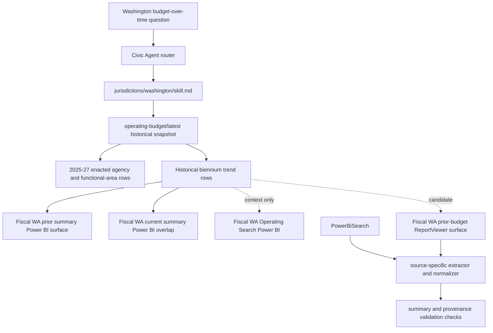

# feat: Extend Washington operating budget historicals

## Summary

Extend `washington.operating_budget` so Civic Agent can answer Washington operating-budget change-over-time questions from official Fiscal WA data. Keep the current 2025-27 enacted snapshot, add historical normalized tables under the same source, and make the data layout reusable for official sources split across per-year or per-biennium surfaces.

---

## Problem Frame

The current Washington source is correct but narrow: it supports the 2025-27 enacted biennial operating budget by agency and functional area. That is enough for "where does Washington budget the most now?" but not for "how has the Washington operating budget changed over time?" The official Fiscal WA operating-budget section treats current and prior budgets as one source family, so the Civic Agent source should do the same rather than forcing users to know about separate report pages.

The implementation should preserve the source-trust contract already used for Seattle, King County, and the first Washington slice: official provenance, explicit supported and unsupported claims, normalized snapshots for report-shaped sources, validation checks, and packaged skill references.

---

## Requirements

**Source Scope**

- R1. `washington.operating_budget` must remain the source id for Washington operating-budget answers, including historical trend answers.
- R2. The source card must distinguish official source surfaces inside the source instead of creating a separate public source family for historical rows.
- R3. Actual spending/checkbook, capital budget, transportation budget, staffing/FTE, K-12 specialized data, and cross-jurisdiction comparisons must remain out of scope unless separate reviewed sources are added.

**Historical Coverage**

- R4. The source must add a historical trend table for statewide operating-budget totals by biennium, using enacted/final base operating budgets as the default comparison mode.
- R5. The source must add agency-by-biennium historical rows when the official surface supports agency-grain extraction with stable labels and validation totals.
- R6. Functional-area historical rows must be added only when the implementation can prove either direct functional-area fields or a stable validated mapping from agency to functional area for each historical period.
- R7. The implementation must attempt historical coverage as far back as the official Fiscal WA operating-budget summary source can be reliably extracted, with a documented accepted prior-summary Power BI surface and documented decisions on Operating Search and older ReportViewer surfaces.

**Semantics And Answering**

- R8. Trend answers must not mix proposal, enacted, biennial base, supplemental changes, and revised-after-supplemental values without an explicit user request.
- R9. The default "budget changed over time" answer must state the budget state, fund view, grain, coverage years/biennia, and caveats.
- R10. The Washington skill must include recipes for statewide historical trends, agency historical trends, and boundaries for unsupported historical grains.
- R11. Chart-ready guidance must include historical Washington trend tables for `@data-analytics` handoff.

**Verification And Packaging**

- R12. The extractor tests must cover historical query-template generation, Power BI compressed-row parsing, budget-state classification, and validation totals.
- R13. The committed snapshot must include `summary.json` and `provenance.json` checks that identify coverage, row counts, model refresh time, source surfaces, query-template hashes, and historical validation checks.
- R14. The packaged plugin and `@civic-agent-dev` install must include the updated Washington reference after implementation.

---

## Key Technical Decisions

- **Fold historical rows into `washington.operating_budget`:** Historical trend questions are a natural extension of the operating-budget source, not a different civic-finance source. The source card should represent multiple official surfaces under one source id, because the source family, provider, measures, and caveats are shared.
- **Use enacted/final base budgets as the default trend mode:** The safest default comparison is a like-for-like biennial operating budget after enactment. Supplemental changes and revised-after-supplemental views are useful, but they answer different questions and must be explicitly labeled.
- **Represent source surfaces explicitly, not generically:** Add source-specific metadata such as `source_surfaces`, `historical_coverage`, and `default_trend_budget_state` to the Washington source card. Avoid introducing a repo-wide schema until more sources force the same shape.
- **Keep normalized rows compact and answer-oriented:** Add dedicated JSONL files for the grains Civic Agent should answer from. Do not commit raw Power BI or ReportViewer payloads unless they are reviewed fixtures.
- **Separate reliable extraction segments:** Treat the Fiscal WA prior operating summary Power BI report as the accepted historical trend surface for enacted base statewide totals from 2013-15 through 2025-27 and agency/function rows from 2013-15 through 2023-25. Stitch current 2025-27 agency/function rows from the current summary report. Keep Operating Search as context-only for this trend source because its 2025-27 enacted aggregate did not reconcile to the accepted summary total. Treat the older ReportViewer surface as a candidate that must pass a bounded extraction proof before it is included in normal answers.
- **Use labels plus session semantics for budget-state classification:** The historical Power BI model exposes labels such as `Enacted`, session types such as biennial or supplemental sessions, and version labels. Do not rely on a single field such as `Final` without validating that it selects the intended budget state.

---

## High-Level Technical Design



The source should have one public identity and multiple extraction surfaces. The answer layer reads normalized snapshot rows only; live Power BI or prior-report calls are refresh-time behavior, not normal answer-time behavior.

---

## Output Structure

Expected shape after implementation:

```text
jurisdictions/washington/
  sources/
    operating-budget.source.json
  scripts/
    extract_operating_budget.py
  data/
    operating-budget/
      query_templates/
        agency-by-fund-view.query.json
        functional-area-by-fund-view.query.json
        version-summary.query.json
        historical-biennium-summary.query.json
        historical-agency-by-biennium.query.json
      historical-query_templates/
        historical-functional-area-by-biennium.query.json
        prior-report-*.query.json or reviewed request descriptors, if accepted later
      <snapshot-version>/
        normalized/
          agency-by-fund-view.jsonl
          functional-area-by-fund-view.jsonl
          version-summary.jsonl
          historical-biennium-summary.jsonl
          historical-agency-by-biennium.jsonl
          historical-functional-area-by-biennium.jsonl, if validated
        summary.json
        provenance.json
  skill.md
tests/
  test_washington_powerbi_extract.py
```

The exact prior-report descriptor filenames can adjust during implementation once the old surface is proven, but the normalized historical table names should remain stable.

---

## Implementation Units

### U1. Extend Washington Source Metadata For Historical Surfaces

- **Goal:** Make the existing source card describe current and historical operating-budget surfaces under one source id.
- **Requirements:** R1, R2, R3, R7, R8
- **Dependencies:** None
- **Files:** `jurisdictions/washington/sources/operating-budget.source.json`, `jurisdictions/washington/data/README.md`, `docs/source-probes/washington-state-budget.md`
- **Approach:** Add Washington-specific fields for source surfaces and historical coverage. Include the current biennial summary Power BI report, the prior summary Power BI report for the accepted historical segment, Operating Search as context-only, and the prior-budget ReportViewer surface as a candidate/conditional older segment. Update the probe note from "not implemented" language to distinguish implemented current and historical summary snapshots from remaining candidate surfaces.
- **Patterns to follow:** Keep the source card as a source-capability declaration, not a universal civic schema. Follow `jurisdictions/king_county/sources/open-budget-dashboard.source.json` and the current Washington source card for safe patterns, caveats, and validation checks.
- **Test scenarios:**
  - Source card parses as JSON and keeps `id = "washington.operating_budget"`.
  - Source card declares the accepted historical Power BI segment, the context-only Operating Search surface, and the conditional older prior-budget segment.
  - Source card still lists actual spending, capital, transportation, staffing/FTE, and 2026 supplemental questions as unsupported unless separately implemented.
- **Verification:** A reviewer can inspect the source card and tell which historical surfaces are accepted, conditional, or out of scope.

### U2. Add Historical Power BI Query Templates And Classification Rules

- **Goal:** Add reviewed query templates for historical statewide, agency, and functional-area trend rows from the Fiscal WA prior summary Power BI model.
- **Requirements:** R4, R5, R7, R8, R12
- **Dependencies:** U1
- **Files:** `jurisdictions/washington/scripts/extract_operating_budget.py`, `jurisdictions/washington/data/operating-budget/query_templates/historical-biennium-summary.query.json`, `jurisdictions/washington/data/operating-budget/query_templates/historical-agency-by-biennium.query.json`, `tests/test_washington_powerbi_extract.py`
- **Approach:** Extend the existing source-specific extractor rather than adding a generic Power BI adapter. Add a second source-surface config for the prior summary report key/model/dataset. Build templates that group by `Biennium`, `Biennium` plus agency, and `Biennium` plus functional area, with explicit filters for enacted base trend semantics: `Operating_VersionInfo.Title35 = Enacted` and `Operating_VersionInfo.SessionType = R1`. Fail closed when a surface cannot reconcile to the accepted statewide totals.
- **Patterns to follow:** Reuse the Washington extractor's Power BI request helpers, compressed-row parser, template hashing, and provenance style. Use the King County `overview-by-year.jsonl` pattern as the precedent for a trend table living alongside narrower detail tables.
- **Test scenarios:**
  - Template builder emits stable historical query JSON matching committed templates.
  - Classification accepts known enacted/final base labels such as `Enacted (05-20-2025)` and rejects proposal labels by default.
  - Classification keeps supplemental sessions out of the default trend mode unless explicitly requested.
  - Historical row parser handles `ValueDicts`, repeat masks, and row-count metrics in the same compressed response format as the current Washington tests.
- **Verification:** The extractor can generate reviewed historical Power BI query templates and parse representative fixture responses without changing current 2025-27 snapshot outputs.

### U3. Normalize Historical Trend Tables And Validation Checks

- **Goal:** Write historical normalized JSONL tables and summary/provenance checks that answer budget-over-time questions safely.
- **Requirements:** R4, R5, R6, R8, R9, R13
- **Dependencies:** U2
- **Files:** `jurisdictions/washington/scripts/extract_operating_budget.py`, `jurisdictions/washington/data/operating-budget/<snapshot-version>/normalized/historical-biennium-summary.jsonl`, `jurisdictions/washington/data/operating-budget/<snapshot-version>/normalized/historical-agency-by-biennium.jsonl`, `jurisdictions/washington/data/operating-budget/<snapshot-version>/normalized/historical-functional-area-by-biennium.jsonl`, `jurisdictions/washington/data/operating-budget/<snapshot-version>/summary.json`, `jurisdictions/washington/data/operating-budget/<snapshot-version>/provenance.json`, `tests/test_washington_powerbi_extract.py`
- **Approach:** Normalize historical rows with explicit fields such as `biennium`, `budget_state`, `budget_version`, `budget_version_filter`, `session_type`, `fund_view`, `amount_thousands`, and `budgeted_amount`. Add `historical-biennium-summary.jsonl` as the minimum accepted trend table. Add agency rows when totals can be reconciled to the statewide historical total. Add functional-area rows only when validated. Summary checks should report coverage ranges, row counts by table, default trend state, totals by biennium, and reconciliation between statewide and agency totals.
- **Patterns to follow:** Current Washington summary/provenance structure, especially `top_*`, row counts, model metadata, query-template hashes, and response checksums.
- **Test scenarios:**
  - Statewide historical rows include the accepted biennia from the live Power BI segment, with dollar-normalized amounts.
  - Agency historical totals reconcile to statewide totals for every included biennium and fund view.
  - Functional-area historical output is omitted or marked unsupported if validation cannot prove it.
  - Summary records `historical_coverage` and `default_trend_budget_state`.
  - Provenance records both the current summary report and historical prior-summary report metadata.
- **Verification:** A source-backed answer can compute total Washington operating-budget change across included biennia using only checked-in normalized rows and summary checks.

### U4. Probe And Integrate The Older Prior-Budget Segment

- **Goal:** Push historical coverage as far back as the official source can be reliably extracted, without weakening normal answer reliability.
- **Requirements:** R7, R8, R13
- **Dependencies:** U1, U3
- **Files:** `jurisdictions/washington/scripts/extract_operating_budget.py`, `jurisdictions/washington/data/operating-budget/historical-query_templates/`, `jurisdictions/washington/data/operating-budget/<snapshot-version>/provenance.json`, `docs/source-probes/washington-state-budget.md`, `tests/test_washington_powerbi_extract.py`
- **Approach:** Treat the Fiscal WA prior Single Version report as an older official surface that may extend operating-budget coverage before 2013-15. First prove whether the ReportViewer requests can be captured, replayed, and validated without UI scraping. If yes, add reviewed request descriptors and normalize older rows into the same historical files. If no, leave the older years as documented context and keep normal answers bounded to the accepted prior-summary Power BI segment.
- **Patterns to follow:** `docs/source-probing.md` guidance for public dashboards and HTML/report surfaces: accept snapshots only when official ownership, replayability, headers/fields, row counts, and validation totals are proven.
- **Test scenarios:**
  - Prior-report extractor fixtures normalize one older biennium into the same historical row shape as Power BI rows.
  - The extractor rejects prior-report responses when the selected session/version does not match the intended enacted/final base budget state.
  - If older extraction is not accepted, source metadata and skill text clearly state the historical lower bound and why.
- **Verification:** The final snapshot either includes older years back to the proven lower bound or documents a clear evidence-based boundary for the older surface.

### U5. Update Washington Skill, Router, And Chart Guidance

- **Goal:** Teach Civic Agent and the packaged plugin how to answer Washington historical trend questions from the expanded snapshot.
- **Requirements:** R9, R10, R11, R14
- **Dependencies:** U3, U4
- **Files:** `jurisdictions/washington/skill.md`, `skill.md`, `skills/civic-agent/SKILL.md`, `plugins/civic-agent/skills/civic-agent/SKILL.md`, `plugins/civic-agent/skills/civic-agent/references/washington.md`, `README.md`, `docs/plan.md`, `scripts/dev.py`
- **Approach:** Add Washington recipes for statewide operating-budget trend, agency trend, and supported historical coverage. Update router triggers to include phrases like "Washington budget over time" and "historical Washington operating budget." Keep caveats prominent: budgeted/authorized values, not actual spending; default trend state is enacted/final base biennial budget; supplemental/revised/proposal comparisons require explicit filters. Refresh the packaged plugin after canonical skill changes.
- **Patterns to follow:** King County's trend section in `jurisdictions/king_county/skill.md` and the current Washington answer trace structure.
- **Test scenarios:**
  - Skill text names the historical normalized files and default filters.
  - Router text routes Washington historical operating-budget prompts to the Washington skill.
  - Dev smoke prompt list includes one Washington historical trend prompt.
  - Packaged `references/washington.md` matches canonical `jurisdictions/washington/skill.md`.
- **Verification:** `@civic-agent-dev` can be installed from the checkout and a fresh thread can manually test a Washington budget-over-time prompt.

### U6. Add Regression Tests And Snapshot Fixtures

- **Goal:** Keep the historical source stable across refreshes and packaging changes.
- **Requirements:** R12, R13, R14
- **Dependencies:** U2, U3, U5
- **Files:** `tests/test_washington_powerbi_extract.py`, `tests/fixtures/washington/`, `tests/test_dev_workflow.py`
- **Approach:** Add compact sanitized fixtures for historical Power BI responses and any accepted older prior-report responses. Expand tests so they cover current 2025-27 behavior and historical behavior together. Keep raw live responses local/debug by default.
- **Patterns to follow:** King County fixture-backed tests and current Washington parser tests.
- **Test scenarios:**
  - Fixture-backed historical Power BI response normalizes to expected biennium totals.
  - Fixture-backed agency response reconciles agency totals to statewide totals.
  - Query templates committed under `query_templates/` match the script builder.
  - Dev workflow verification detects stale packaged Washington references.
  - Current 2025-27 tests still pass unchanged.
- **Verification:** Focused Washington tests, package freshness checks, and dev workflow tests pass after the historical snapshot is regenerated.

---

## Scope Boundaries

Deferred to follow-up work:

- Actual spending and vendor/checkbook history from Fiscal WA Open Checkbook XLSX downloads.
- Capital, transportation, staffing/FTE, and K-12 specialized historical budget sources.
- Cross-jurisdiction comparisons with Seattle or King County.
- A generic Power BI adapter or generic per-year CSV source framework.
- Inflation-adjusted trend calculations unless a reviewed CPI/source and answer contract are added.

Outside this plan:

- Treating proposal-stage budgets as the default historical trend.
- Treating supplemental changes as the same measure as base enacted biennial budgets.
- Inferring policy outcomes, service quality, or operational performance from budget totals.

---

## Risks & Dependencies

- **Historical labels may drift by biennium:** Older biennia use different labels, dates, or session names. Mitigation: explicit classification tests and fail-closed behavior for unrecognized labels.
- **Agency labels may change over time:** Agency trend answers may reflect reorganizations or label changes. Mitigation: preserve official labels first, and only add rollup/crosswalks after a separate reviewed mapping exists.
- **Older ReportViewer extraction may be brittle:** The prior Single Version surface may not be replayable without fragile UI behavior. Mitigation: keep it as a separate accepted-or-rejected segment inside the same source, and do not block the accepted 2013-15+ prior-summary Power BI historical segment on it.
- **Totals can be wrong if a surface has a different semantic grain:** Operating Search is official, but its 2025-27 enacted aggregate did not reconcile to the accepted summary total. Mitigation: default trend filters must select one budget state and validation checks must reconcile totals by biennium and across overlapping surfaces.
- **Snapshot size could grow:** Agency-by-biennium rows should still be compact, but older report rows may add volume. Mitigation: commit normalized rows and compact fixtures, not raw responses.

---

## Acceptance Examples

- AE1. Statewide historical trend
  - **Given:** The expanded Washington snapshot includes historical biennium summary rows.
  - **When:** A user asks how Washington's operating budget changed over time.
  - **Then:** Civic Agent uses `historical-biennium-summary.jsonl`, defaults to enacted/final base biennial operating budgets, states the coverage range, and includes a validation check.

- AE2. Agency historical trend
  - **Given:** Agency historical rows reconcile to statewide totals.
  - **When:** A user asks how the Public Schools budget changed over time.
  - **Then:** Civic Agent filters `historical-agency-by-biennium.jsonl` by the official agency label, reports budgeted amounts by biennium, and caveats agency label changes.

- AE3. Supplemental ambiguity
  - **Given:** A user asks whether the budget changed after supplementals.
  - **When:** The default trend table only covers base enacted biennial budgets.
  - **Then:** Civic Agent either uses a separately supported supplemental/revised table or says that supplemental historical comparisons are not supported by the current snapshot.

- AE4. Older coverage boundary
  - **Given:** Fiscal WA lists prior budgets back to 2003-05.
  - **When:** The older ReportViewer surface cannot be reliably replayed or validated.
  - **Then:** Civic Agent states the supported historical lower bound from the checked-in snapshot and points to the official older source as context rather than answering from unvalidated rows.

---

## System-Wide Impact

This plan changes the Washington source from a single-snapshot current-budget source into a multi-surface operating-budget source. That will set the precedent for other jurisdictions where one official source family is split across yearly files, per-biennium reports, or current/prior dashboards. The key reusable pattern is not a generic extractor; it is a source card and snapshot layout that can say "one accepted source, multiple official surfaces, one normalized answer contract."

---

## Sources And Research

- `jurisdictions/washington/scripts/extract_operating_budget.py`: current source-specific Washington Power BI extractor, parser, normalizer, summary, and provenance pattern.
- `jurisdictions/washington/sources/operating-budget.source.json`: current source card and supported/unsupported Washington source slice.
- `jurisdictions/king_county/scripts/extract_open_budget.py`: precedent for a report-shaped source with a year trend table and narrower detail tables.
- `jurisdictions/king_county/skill.md`: precedent for trend answer recipes and explicit unsupported department-level trend boundaries.
- `docs/source-probing.md`: public dashboard snapshot rules, Power BI caution, validation expectations, and accepted source artifacts.
- `docs/architecture.md`: source-card and report-shaped snapshot layout.
- `docs/brainstorms/2026-06-04-contribution-workflow-requirements.md`: source-trust requirements that shaped the current source bar.
- Fiscal WA operating budget main page: `https://fiscal.wa.gov/statebudgets/operatingbudgetmain`
- Fiscal WA prior operating reports page: `https://fiscal.wa.gov/statebudgets/operatingsummarygraphicprior`
- Fiscal WA prior Single Version report: `https://fiscal.wa.gov/statebudgets/OperatingSingleVersionPrior`
- Planning probe update: the Fiscal WA operating-search Power BI model is official but context-only for this trend source because its 2025-27 enacted aggregate did not reconcile to the accepted summary total.
- Accepted historical probe: the Fiscal WA prior summary Power BI model `BudOpSummaryBudgetVersionsPrior` exposed enacted base statewide totals for `2013-15` through `2025-27`, with model refresh time `2025-12-29T18:08:24.87`.
