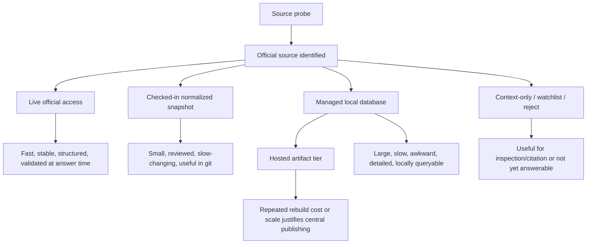
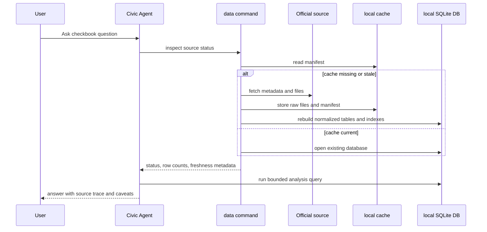

# feat: Add Source Data Storage Policy And Washington Checkbook

## Summary

Add Washington Open Checkbook as the first large-detail Civic Agent source while turning the implementation into a reusable source data-handling playbook. The source workflow should prefer live official access, preserve checked-in snapshots for compact reviewed data, use a managed local database for large or slow-to-parse detail data, and document hosted artifacts as the later scale tier.

---

## Problem Frame

Civic Agent already has three useful data-access shapes: Seattle uses a clean live Socrata source, King County uses a checked-in normalized Power BI snapshot, and Washington uses checked-in normalized snapshots for operating budget and revenue. Those patterns should remain valid. The new Washington Open Checkbook source is different: the official source exposes large XLSX files with full vendor-payment detail. The current 2025-27 file alone is about 22 MB and 382,783 rows, and the available historical XLSX files from 2013-15 through 2025-27 total about 411 MB before normalization.

The goal is not to turn every source into a local warehouse. The goal is to make source selection explicit and repeatable: hit live official sources when they are fast and structured; commit small reviewed snapshots when that keeps the repo self-contained; use a managed local database when full-detail data is too large, slow, or awkward for git and answer-time parsing. Washington Open Checkbook should prove that path without overbuilding hosted infrastructure before the repo needs it.

---

## Requirements

**Source Data Playbook**

- R1. New source probes must classify data handling into live official access, checked-in snapshot, managed local database, hosted artifact, context-only, watchlist, or reject.
- R2. Source cards must be able to declare a storage/access policy without breaking existing source cards that do not yet declare one.
- R3. The playbook must preserve the existing checked-in snapshot approach for compact normalized data, including King County, Washington operating budget, and Washington revenue.
- R4. The playbook must identify when raw files and full-detail normalized data are too large for git and should live in an ignored local cache or future hosted artifact.
- R5. The coverage matrix remains source-scoped. A managed local database source should still use `coverage_claims` only after a probe proves supported measures, grains, time coverage, evidence, and caveats.

**Managed Local Data Lifecycle**

- R6. The repo must provide an agent-runnable data command that can inspect, create, refresh, and report status for managed local data sources.
- R7. Managed local data must record freshness metadata: official URL, fetched time, file size, last-modified or equivalent source metadata, checksum when available, row counts, and data-through boundary when the source is partial.
- R8. Managed local data must support fast repeated analysis after the first setup without re-downloading or re-parsing large source files on every user question.
- R9. The local data location must be outside git by default, overridable for tests, and covered by `.gitignore` for any repo-local debug output.
- R10. The first managed local database backend must work in the current repo without adding a heavy packaging requirement for normal tests or plugin generation.

**Washington Open Checkbook**

- R11. Washington Open Checkbook must be added as a separate actual-spending/checkbook source, not mixed into Washington operating budget or revenue sources.
- R12. The source must support state agency vendor-payment analysis by biennium, fiscal year, fiscal month, agency, object/category, subobject/subcategory, vendor, and amount.
- R13. Historical checkbook files should be supported from 2013-15 through the current 2025-27 partial biennium when the official XLSX file pattern and headers validate.
- R14. Current-biennium answers must include a data-through boundary, derived from the official monthly-update cadence and the latest fiscal year/month present in the file.
- R15. Full historical line items must not be committed to git. Git may contain source metadata, probes, extractor/normalizer code, validation tests, small fixtures, provenance shapes, and compact rollups only if they remain small enough to review.

**Answer Experience**

- R16. For a user asking a supported checkbook question, Civic Agent should be able to ensure the local managed database exists or clearly report what setup/update is needed.
- R17. Answers from managed data must include a compact trace: source, storage policy, local data version/freshness, grain, measure, filters, validation check or row count, and caveats.
- R18. The Washington skill must reject or caveat budget, revenue, staffing, procurement-contract, payroll, invoice, and service-outcome claims that the checkbook source does not support.

---

## Key Technical Decisions

- KTD1. **Use a four-tier source data policy:** Source cards should distinguish `live`, `checked_in_snapshot`, `managed_local_db`, and `hosted_artifact`. The existing `access_method` field can remain for source-specific extraction shape, while a new storage policy explains where answer data lives and how freshness is checked.
- KTD2. **Keep checked-in snapshots as a first-class tier:** Small normalized snapshots are still useful because they make the repo inspectable, testable, and self-contained. This plan adds a large-data tier; it does not replace current snapshots.
- KTD3. **Start the managed local database with SQLite:** SQLite is available through Python's standard library, is serverless and zero-configuration, and fits the repo's current dependency-free scripts. This avoids blocking Washington Open Checkbook on a new packaging/runtime story. DuckDB and Parquet remain the likely hosted or packaged-artifact upgrade path once the project has explicit dependency management.
- KTD4. **Store full line-item checkbook data outside git:** Raw XLSX files, full-detail normalized rows, and the local database belong in a local cache managed by the CLI. Git stores the contract, not the bulk data: source card, probe, parser, small fixtures, summaries, provenance schema, tests, and optional compact rollups.
- KTD5. **Make freshness explicit, not implicit:** Managed sources need a status model that can say `missing`, `current`, `stale`, `partial_current_period`, `refresh_failed`, or `unknown`. For Open Checkbook, freshness combines official file metadata with the maximum fiscal year/month present in the data.
- KTD6. **Use one logical source id with per-file surfaces:** Washington Open Checkbook is one source family with one row contract. Each biennium XLSX file should be represented as a `source_surface` with URL, status, coverage, file metadata, checksum, row count, and header validation.
- KTD7. **Separate setup from normal answer semantics:** The answer path should not parse XLSX live. For managed sources, the agent or CLI first ensures the local database, then normal answers query indexed tables. If the host cannot run local setup, the skill should fail clearly rather than pretending the data is available.
- KTD8. **Do not build hosted artifact infrastructure now:** The plan should document hosted artifacts as the scale tier, but active implementation stops at local managed database support plus Washington Open Checkbook. Object storage, signed artifacts, centralized ingestion jobs, and hosted APIs are deferred.

---

## High-Level Technical Design

### Source Data Policy



### Managed Local Database Lifecycle



The source policy is part of source evaluation; the local database lifecycle is part of answer readiness. Keeping those separate prevents the source card from becoming an implementation script while still making freshness and storage behavior visible to the agent.

---

## Implementation Units

### U1. Source Data Storage Playbook

- **Goal:** Update the general source workflow so every future source is classified through the same storage/access policy before implementation.
- **Requirements:** R1, R3, R4, R5
- **Dependencies:** None
- **Files:**
  - `docs/source-probing.md`
  - `docs/templates/source-probe-brief.md`
  - `docs/architecture.md`
  - `README.md`
  - `docs/source-data-storage.md`
- **Approach:** Add a compact storage policy section that sits beside the existing source type matrix. Define the allowed tiers, decision criteria, examples from current sources, and what artifacts belong in git versus local cache. Keep the language source-probe oriented: prove source capabilities first, then choose the lightest durable storage tier that supports fast trustworthy answers.
- **Patterns to follow:** `docs/source-probing.md` source type matrix, `docs/architecture.md` source metadata and optional snapshot sections, `README.md` Data Strategy.
- **Test scenarios:**
  - Happy path: the playbook names Seattle as live, King County and Washington budget/revenue as checked-in snapshots, and Washington Open Checkbook as managed local database.
  - Edge case: the playbook explicitly allows compact checked-in snapshots and does not imply all non-live sources should become local databases.
  - Edge case: the playbook keeps hosted artifacts out of current implementation scope while naming when that tier becomes appropriate.
  - Integration: `docs/templates/source-probe-brief.md` prompts source investigators to record storage tier, freshness check, repo artifact policy, and local/hosted artifact decision.
- **Verification:** A future source probe has a clear decision path for live, checked-in snapshot, managed local DB, hosted artifact, context-only, watchlist, or reject.

### U2. Source Card Storage Policy Contract

- **Goal:** Extend source cards and coverage tests so reviewed sources can declare storage behavior without forcing immediate schema formalization.
- **Requirements:** R2, R5, R7, R15
- **Dependencies:** U1
- **Files:**
  - `jurisdictions/seattle/sources/operating-budget.source.json`
  - `jurisdictions/king_county/sources/open-budget-dashboard.source.json`
  - `jurisdictions/washington/sources/operating-budget.source.json`
  - `jurisdictions/washington/sources/revenue-by-biennium.source.json`
  - `tests/test_source_coverage.py`
  - `tests/test_source_storage_policy.py`
- **Approach:** Add optional `storage_policy` metadata to current source cards, then test the common contract without requiring a full JSON schema. The contract should allow current cards to declare `tier`, `normal_answer_source`, `repo_artifacts`, `local_artifacts`, `freshness_check`, and `refresh_behavior`. Existing `access_method` values remain source-specific extraction descriptors such as `socrata`, `powerbi_snapshot`, or `reportviewer_snapshot`.
- **Technical design:** Directional policy shape:

  ```text
  storage_policy:
    tier: live | checked_in_snapshot | managed_local_db | hosted_artifact
    normal_answer_source: official_api | repo_snapshot | local_db | hosted_artifact
    freshness_check: api_metadata | source_file_metadata | model_refresh | manual_snapshot_version
    repo_artifacts: source_card | normalized_snapshot | summary | provenance | fixture
    local_artifacts: raw_source_file | local_database | debug_capture
  ```

- **Patterns to follow:** Existing `coverage_claims` tests in `tests/test_source_coverage.py`; source-card style in current jurisdiction files.
- **Test scenarios:**
  - Happy path: current source cards with `storage_policy` parse and use allowed tier/status values.
  - Happy path: supported or partial `coverage_claims` can cite storage/freshness evidence that exists on the source card.
  - Edge case: a source card without `storage_policy` remains valid for backwards compatibility during transition.
  - Edge case: managed local database policies must name which artifacts are not committed to git.
  - Error path: tests fail on unknown storage tier, missing normal-answer source, or a managed local DB policy with no freshness check.
- **Verification:** Source cards can communicate storage behavior to future agents without turning the repo into a strict schema migration project.

### U3. Managed Local Data Command And Cache Layout

- **Goal:** Provide a dependency-light CLI entrypoint for inspecting, ensuring, refreshing, and querying managed local sources.
- **Requirements:** R6, R7, R8, R9, R10, R16, R17
- **Dependencies:** U1, U2
- **Files:**
  - `scripts/source_data.py`
  - `tests/test_source_data.py`
  - `.gitignore`
  - `README.md`
  - `docs/source-data-storage.md`
- **Approach:** Add an agent-runnable script with source-agnostic lifecycle commands. It should read source cards, route to source-specific builders, write local manifests, and report status in a compact machine-readable and human-readable form. Use a home-directory data location by default, allow `CIVIC_AGENT_DATA_HOME` for tests and alternate installs, and keep repo-local debug output under ignored directories. The first backend should use Python's standard-library `sqlite3`; do not add DuckDB, pandas, or openpyxl as required dependencies in this unit.
- **Technical design:** Directional command surface:

  ```text
  inspect <source_id>
  status <source_id>
  ensure <source_id>
  refresh <source_id>
  query <source_id> <named_query>
  ```

  The command should expose these capabilities and emit JSON when asked so agents can consume status without scraping prose.

- **Patterns to follow:** `scripts/dev.py` agent-run helper style, standard-library Python in existing extractors, `.generated/` ignore policy.
- **Test scenarios:**
  - Happy path: `inspect` loads a source card and reports its storage tier and configured freshness strategy.
  - Happy path: `status` returns `missing` when no local manifest or database exists.
  - Happy path: `ensure` with a test data home calls a fake source builder, writes a manifest, and reports row counts.
  - Edge case: `CIVIC_AGENT_DATA_HOME` isolates test state so tests do not touch a developer's real cache.
  - Error path: unknown source id, malformed source card, missing builder, and stale manifest each produce clear nonzero status without corrupting existing cache files.
  - Integration: the local command can be invoked by a future jurisdiction skill without needing generated plugin files to be edited by hand.
- **Verification:** A maintainer or agent can determine whether a managed source is missing, current, stale, or failed, and can rebuild it without manually finding cache paths.

### U4. Washington Open Checkbook Source Card And Probe

- **Goal:** Accept Fiscal WA Open Checkbook as a reviewed Washington actual-spending/checkbook source with clear boundaries.
- **Requirements:** R11, R12, R13, R14, R15, R18
- **Dependencies:** U1, U2
- **Files:**
  - `docs/source-probes/washington-open-checkbook.md`
  - `docs/source-probes/washington-state-budget.md`
  - `jurisdictions/washington/sources/open-checkbook.source.json`
  - `jurisdictions/washington/README.md`
  - `jurisdictions/washington/data/README.md`
  - `tests/test_source_coverage.py`
  - `tests/test_washington_checkbook_source.py`
- **Approach:** Create a separate source card `washington.open_checkbook` with `budget_family` or equivalent classification for actual spending/checkbook. Record the Fiscal WA inspection page, XLSX file surfaces for 2013-15 through 2025-27, observed headers, file sizes, last-modified values, monthly update statement, fields, safe answer patterns, unsupported claims, validation checks, and coverage claim for `budget_finance.actual_spending_checkbook`. Keep operating budget and revenue source cards explicitly unsupported for this category.
- **Patterns to follow:** `jurisdictions/washington/sources/revenue-by-biennium.source.json`, `docs/source-probes/washington-state-budget.md`, `docs/coverage-taxonomy.md`.
- **Test scenarios:**
  - Happy path: `washington.open_checkbook` source card parses and carries `storage_policy.tier` as `managed_local_db`.
  - Happy path: the source card's accepted surfaces include available XLSX file URLs from 2013-15 through 2025-27.
  - Happy path: `coverage_claims` marks `budget_finance.actual_spending_checkbook` as supported or partial with measures, grains, time coverage, evidence, and caveats.
  - Edge case: unsupported claims explicitly include operating budget authority, revenue forecasts, contracts/procurement terms, payroll, invoices, staffing, and service outcomes.
  - Integration: the generated coverage matrix rolls Washington actual-spending/checkbook from `unsupported-by-reviewed-source` to supported or partial once the new source card is present.
- **Verification:** A reader can inspect the official Fiscal WA page and understand exactly what Open Checkbook supports before any local database is built.

### U5. Washington Checkbook Extractor And SQLite Builder

- **Goal:** Download official checkbook XLSX files, normalize their rows, and build the local SQLite database with provenance and indexes.
- **Requirements:** R7, R8, R9, R10, R12, R13, R14, R15
- **Dependencies:** U3, U4
- **Files:**
  - `jurisdictions/washington/scripts/extract_open_checkbook.py`
  - `tests/test_washington_checkbook_extract.py`
  - `tests/fixtures/washington/open_checkbook_sample.xlsx`
  - `tests/fixtures/washington/open_checkbook_expected_rows.json`
- **Approach:** Implement a Washington-specific builder that streams official XLSX files into the managed local cache, validates headers, normalizes labels, derives fiscal/calendar periods, and writes rows to SQLite. Use source surfaces from the source card rather than hardcoded year lists where practical. Include an atomic rebuild pattern: write to a temporary database, validate row counts and totals, then promote it over the previous database only after checks pass.
- **Technical design:** Directional database tables:

  ```text
  source_files(file_id, biennium, url, fetched_at, last_modified, content_length, sha256, row_count, status)
  payments(biennium, fiscal_year, fiscal_month, calendar_month, agency_code, agency_name, object_code, category, subobject_code, subcategory, vendor_name, amount)
  refresh_runs(run_id, started_at, finished_at, status, message)
  ```

  Add indexes that match expected answer filters: biennium, fiscal year/month, agency, category/subcategory, vendor, and combinations used by top-N aggregations.

- **Execution note:** Add parser and builder tests before running full live downloads. The XLSX parser can be implemented with Python's standard-library ZIP/XML tools to avoid a dependency on openpyxl.
- **Patterns to follow:** Washington revenue extractor's provenance and actual-data-through handling, King County and Washington snapshot validation style, `scripts/source_data.py` builder interface from U3.
- **Test scenarios:**
  - Happy path: a small XLSX fixture with the official headers normalizes to payment rows with trimmed labels and numeric amounts.
  - Happy path: builder creates SQLite tables, indexes, `source_files`, and manifest metadata in a test data home.
  - Happy path: current biennium data-through metadata is derived from the maximum fiscal year/month in the fixture and mapped to a calendar month.
  - Edge case: the older `Fiscal Month` header variant normalizes to the same field as current `FMonth`.
  - Edge case: blank vendors, negative amounts, reimbursement categories, and whitespace-padded labels are preserved or normalized according to documented rules.
  - Error path: header mismatch, invalid XLSX, failed download, checksum mismatch, and validation-total mismatch leave the previous database intact.
  - Integration: `scripts/source_data.py ensure washington.open_checkbook` can build the source through the Washington builder using fixture mode in tests.
- **Verification:** Local DB builds are repeatable, status metadata is complete, and no full raw XLSX or full line-item dump is added to git.

### U6. Washington Checkbook Answer Routing

- **Goal:** Teach the Washington jurisdiction skill how to use the managed local checkbook database for supported actual-spending questions.
- **Requirements:** R16, R17, R18
- **Dependencies:** U3, U4, U5
- **Files:**
  - `jurisdictions/washington/skill.md`
  - `skill.md`
  - `skills/civic-agent/SKILL.md`
  - `scripts/package_plugin.py`
  - `tests/test_dev_workflow.py`
- **Generated outputs:**
  - `plugins/civic-agent/skills/civic-agent/SKILL.md`
  - `plugins/civic-agent/skills/civic-agent/references/washington.md`
- **Approach:** Add routing guidance for Washington actual-spending/checkbook questions. The skill should distinguish budgeted/authorized operating budget, revenue estimate-vs-actual reports, and actual vendor payments. For managed local DB sources, instructions should tell the agent to inspect/ensure source data first when local execution is available, then query the local DB. If local execution is unavailable or the DB is stale and cannot be refreshed, the answer should explain the source is accepted but local data is not ready.
- **Patterns to follow:** Existing Washington skill sections for operating and revenue, router source registry style, generated package workflow.
- **Test scenarios:**
  - Happy path: a Washington checkbook question routes to the Open Checkbook source and includes local data freshness in the trace.
  - Happy path: category breakdown, agency ranking, vendor ranking, and monthly trend recipes name the expected local DB fields and caveats.
  - Edge case: a budget question still uses `washington.operating_budget`, not Open Checkbook.
  - Edge case: a revenue question still uses `washington.revenue_by_biennium`, not Open Checkbook.
  - Error path: local DB missing or stale produces setup/update guidance rather than fabricated numbers.
  - Integration: package generation includes updated Washington references and does not hand-edit generated files.
- **Verification:** Normal answer routing keeps source families separate and lets a future agent run the data lifecycle without the user manually managing files.

### U7. Checkbook Demo, Validation Notes, And Future Hosted Tier

- **Goal:** Document the user-facing value of checkbook analysis, prove one representative answer, and record the path to hosted artifacts without building them now.
- **Requirements:** R1, R4, R14, R15, R17
- **Dependencies:** U5, U6
- **Files:**
  - `docs/washington-checkbook-demo.md`
  - `docs/source-data-storage.md`
  - `README.md`
  - `examples/prompts.md`
- **Approach:** Add worked examples that show why checkbook data is useful: spending by agency, category breakdown, top vendors, monthly trend, and current-biennium partial-status caveats. Include the trace fields and freshness checks expected from managed local data. In the storage doc, add the future hosted artifact tier as a scaling path for repeated expensive rebuilds, but keep it out of current implementation units.
- **Patterns to follow:** `docs/king-county-demo.md`, `docs/seattle-demo.md`, `docs/coverage-matrix.md` wording that avoids jurisdiction-wide overclaims.
- **Test scenarios:**
  - Happy path: demo answers include source, local DB status, row count, data-through boundary, grain, filters, validation check, and caveats.
  - Edge case: demo text does not imply vendor payments equal budget authority, contract obligations, invoices, payroll, or service outcomes.
  - Integration: prompt examples make the checkbook source discoverable without blurring it with Washington operating budget or revenue.
- **Verification:** A future reader understands both the checkbook source's analytical value and the data-handling rule that made a local DB appropriate.

---

## Acceptance Examples

- AE1. A future contributor probes a large official CSV or XLSX source. The probe brief requires them to decide whether the source is live, checked-in snapshot, managed local DB, hosted artifact, context-only, watchlist, or rejected before adding a source card.
- AE2. A user asks, "Which Washington agencies had the most vendor payments in the current biennium?" Civic Agent checks the managed local DB status, uses Open Checkbook rows if current, and answers with agency totals plus data-through caveat.
- AE3. A user asks, "How does actual vendor spending compare with the enacted operating budget?" Civic Agent can explain the two source families and caveats, but does not silently mix measures or imply direct budget-vs-actual reconciliation unless a reviewed comparison recipe exists.
- AE4. A user clones the repo. They can still run tests and inspect current checked-in snapshots without downloading hundreds of megabytes of checkbook data.
- AE5. A developer refreshes Washington Open Checkbook. The command detects official file changes, rebuilds the local database atomically, records provenance, and reports new row counts and current data-through month.

---

## Scope Boundaries

### In Scope

- General source data storage policy across source probes, source cards, docs, and tests.
- A dependency-light managed local database lifecycle command.
- Washington Open Checkbook source card, probe, local DB builder, and answer routing.
- Local SQLite database support for full checkbook line-item history.
- Freshness, provenance, row-count, and data-through metadata for local managed sources.
- Small fixtures, tests, summaries, and docs that make the pattern repeatable.

### Deferred to Follow-Up Work

- Hosted object storage, signed artifact downloads, central ingestion jobs, or a hosted Civic Agent API.
- DuckDB/Parquet artifact publishing, unless implementation discovers SQLite cannot satisfy the first checkbook answer patterns.
- A formal JSON schema package for all source cards.
- Generic XLSX, Power BI, Tableau, or Socrata adapter frameworks beyond the source-specific code required here.
- Cross-jurisdiction actual-spending normalization.
- Procurement-contract analysis from Washington's data.wa.gov contracts dataset.
- Payroll, invoice, staffing, and service-outcome sources.

### Outside This Source

- Treating checkbook vendor payments as operating budget authority.
- Treating checkbook vendor payments as contract obligations or procurement terms.
- Treating current 2025-27 partial data as final full-biennium actual spending.
- Committing full historical raw XLSX files or full-detail line-item dumps to git.

---

## System-Wide Impact

This work changes Civic Agent's source intake posture. Future sources should no longer choose "snapshot" as a vague catch-all. They should declare how answer data is accessed, why that tier is appropriate, what freshness means, which artifacts belong in git, and what the agent should do when data is missing or stale. The change also introduces a local persistent-data surface, so tests and docs must make it clear that repo checkout state, installed plugin state, and user-local data cache state are separate.

---

## Risks And Dependencies

- **Runtime dependency creep:** DuckDB and Parquet are strong analytical tools, but adding them now would require a dependency story the repo does not have. Starting with SQLite reduces install friction, while documenting the upgrade path avoids locking the architecture to SQLite forever.
- **Plugin execution limits:** Current Civic Agent is skill/plugin-first. Some hosts may not allow shell execution or local database setup. The skill must distinguish "source accepted" from "local data ready" and fail clearly when setup cannot run.
- **SQLite performance may be enough but should be measured:** The first implementation should validate representative top-N and grouped queries over the full historical database. If SQLite is too slow, that evidence should trigger the DuckDB/Parquet follow-up rather than premature abstraction now.
- **Official file shape can drift:** The XLSX files are official but not a documented API. Header validation, file metadata, checksum recording, and atomic rebuilds reduce the risk of silently writing bad local data.
- **Freshness is nuanced for partial periods:** The Fiscal WA page says current-biennium data is added monthly with previous-month vendor payments. Answers must carry a data-through boundary and not imply final actuals.
- **Large local caches can surprise users:** The CLI should report expected download size and existing cache size before large refreshes when possible, and docs should explain how to clear or relocate the cache.
- **Source-family mixing remains a core risk:** Washington now has budget, revenue, and actual-payment sources. Router and skill updates must keep these separate unless a future reviewed comparison recipe exists.

---

## Documentation And Operational Notes

- The storage playbook should be the required checkpoint for future source additions, alongside `docs/source-probing.md`.
- Managed local data should be treated like generated dev artifacts: reproducible, ignored by git, and safe to delete/rebuild.
- Normal Civic Agent answers from checked-in snapshots should continue to work without any local DB setup.
- Washington Open Checkbook answers should include data-through information, not just snapshot build time.
- Local raw XLSX downloads should remain cache artifacts. Commit only compact fixtures or reviewed rollups that are small enough to justify repo storage.
- The future hosted tier should be described as an operational scaling step, not as a prerequisite for the Washington source.

---

## Sources And Research

- Existing live source pattern: `jurisdictions/seattle/sources/operating-budget.source.json`, `jurisdictions/seattle/data/README.md`.
- Existing checked-in snapshot patterns: `jurisdictions/king_county/data/README.md`, `jurisdictions/washington/data/README.md`, `docs/architecture.md`.
- Existing coverage model: `docs/coverage-taxonomy.md`, `docs/coverage-matrix.md`, `scripts/coverage.py`, `tests/test_source_coverage.py`.
- Washington Open Checkbook probe context: `docs/source-probes/washington-state-budget.md`.
- Agent-run helper pattern: `scripts/dev.py`, `tests/test_dev_workflow.py`.
- Fiscal WA Open Checkbook official page: `https://fiscal.wa.gov/Spending/Checkbook.aspx`.
- Fiscal WA current XLSX surface: `https://fiscal.wa.gov/Spending/VendorPayments2527.xlsx`.
- SQLite official documentation describes SQLite as serverless and zero-configuration, and as a common application file format: `https://www.sqlite.org/serverless.html`, `https://www.sqlite.org/zeroconf.html`, `https://www.sqlite.org/appfileformat.html`.
- DuckDB and Parquet remain relevant future tiers for packaged/hosted analytical artifacts: `https://duckdb.org/docs/stable/clients/python/overview`, `https://duckdb.org/docs/stable/data/parquet/overview`, `https://parquet.apache.org/`.

---

## Final Acceptance Checklist

- Future source probes include a storage/access policy decision.
- Existing compact checked-in snapshots remain valid and documented.
- Source cards can declare storage policy without requiring a broad schema migration.
- Managed local source status can be inspected and refreshed through an agent-runnable command.
- Washington Open Checkbook has a source card, coverage claim, local DB builder, skill routing, and worked demo.
- Full raw XLSX history and full line-item output are not committed to git.
- Tests cover source-card storage policy, local cache lifecycle, Washington XLSX parsing, SQLite build metadata, and source-family routing boundaries.
- Documentation makes the future hosted artifact tier visible while keeping it out of the active implementation scope.
