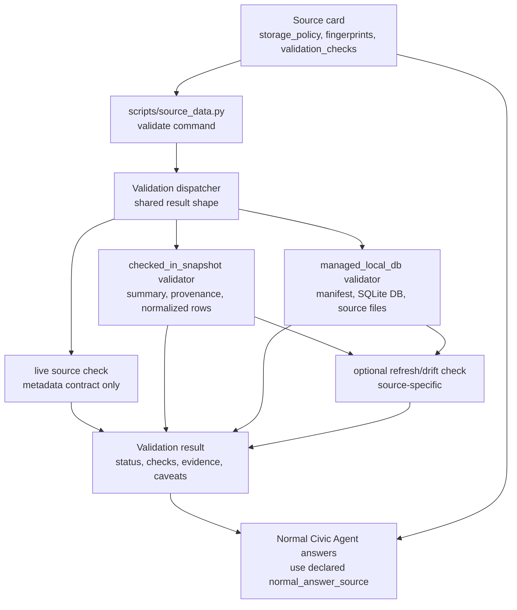
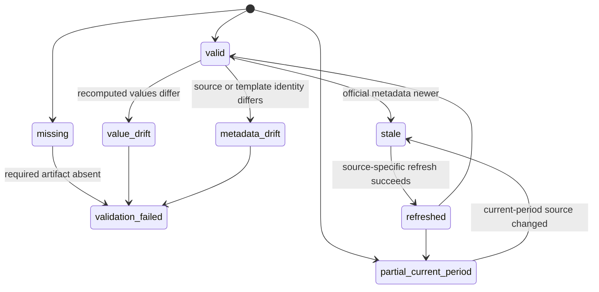

# feat: Add Stored Source Data Validation Workflow

## Summary

Add a repeatable validation workflow for Civic Agent's stored source data. The workflow generalizes the earlier snapshot-validation goal across current storage tiers: checked-in snapshots, managed local databases, source fingerprints, and the metadata contracts that make live and future hosted sources trustworthy.

---

## Problem Frame

The original snapshot-validation plan targeted checked-in King County and Washington Power BI snapshots. That goal is still valid, but the repo now has a broader source-data storage model: Seattle is live, King County and Washington operating/revenue are checked-in snapshots, and Washington Open Checkbook is a managed local SQLite database built from official XLSX files. A snapshot-only validator would immediately miss the newest large-data path.

The underlying user concern is data trust. Civic Agent should be able to say whether stored data is internally consistent, tied back to official source surfaces, fresh enough for its stated boundary, and safe to use for source-backed answers. It should not claim every row has been independently audited, and it should not make normal answers depend on brittle live replays of report dashboards. The validation workflow should start offline and local, then support optional source-specific refresh checks that classify drift without changing answer behavior.

The repo already has much of the fingerprint data in source-specific form. Source cards carry public inspection URLs and accepted source surfaces; Power BI snapshots carry report URLs, API hosts, model/report/dataset identifiers, query-template hashes, response hashes, filters, and extraction timestamps; ReportViewer revenue snapshots carry report parameters and export hashes; Washington Open Checkbook source surfaces carry XLSX URLs, last-modified headers, content lengths, and data-through boundaries. The gap is that these fingerprints are not yet a uniform acceptance contract that every stored artifact must satisfy and every answer can cite cleanly.

This plan follows the source-trust bar from `docs/brainstorms/2026-06-04-contribution-workflow-requirements.md`: official provenance, explicit scope, supported and unsupported claims, validation checks, caveats, and package freshness. It also preserves the storage-tier decisions from `docs/source-data-storage.md`: compact reviewed data may remain in git, large detail data belongs in a managed local cache, and hosted artifact infrastructure is deferred until scale justifies it.

---

## Requirements

**Stored Source Trust Contract**

- R1. Every accepted stored source must expose enough validation metadata for a maintainer or agent to connect answer data back to the source card, official human inspection URLs, machine endpoints or file URLs, retrieval parameters, version/freshness boundary, row counts, and validation checks.
- R2. Validation must be storage-tier aware. `checked_in_snapshot` sources validate repo artifacts; `managed_local_db` sources validate the local manifest and database; `live` sources validate source-card metadata and should not require a local artifact.
- R3. Validation output must use one compact result shape across tiers so agents can report pass/fail/stale/partial status without scraping source-specific prose.
- R4. Source-card validation checks, snapshot summaries, provenance files, and managed manifests must agree where they describe the same source facts.
- R15. Every stored artifact must expose a structured source fingerprint that captures retrievable origin details: public inspection URL, machine URL or endpoint, source-surface id, report/dashboard/file identifiers, request parameters or filters, query template or export identity, version/freshness timestamp, data-through boundary when applicable, row counts, content lengths when available, and checksums or hashes.
- R16. Source-backed answer traces must be able to cite user-facing source evidence from the fingerprint: public source URL, dataset/report/file identity, version or data-through boundary, and the relevant query/filter context.
- R17. The current accepted sources must be patched to meet the fingerprint contract before strict validators treat the contract as mandatory.

**Offline And Local Validation**

- R5. The default validation run must work without network access for checked-in snapshots and existing managed local databases.
- R6. Checked-in snapshot validators must recompute source-specific totals from normalized rows instead of trusting `summary.json` alone.
- R7. Managed local database validators must verify manifest shape, database presence, schema, indexes or queryability, source-file metadata, row counts, data-through boundaries, and representative aggregate checks.
- R8. Validation must fail clearly when required files are missing, JSON is malformed, row counts drift, query-template hashes drift, summary totals diverge, or a local database is absent.

**Spot Checks And Drift Checks**

- R9. Stored sources must define representative spot checks that cover high-value totals, top rows or aggregates, edge cases, and source-specific filters when applicable.
- R10. Optional refresh/drift checks must be source-specific and must not run during ordinary answer generation.
- R11. Drift output must distinguish local corruption from official-source change, including at least unchanged, partial-current-period, stale, value drift, source metadata drift, endpoint/template drift, and validation failure.

**Workflow And Answer Boundaries**

- R12. Normal Civic Agent answers must continue to use the declared normal answer source from `storage_policy`; validation must not silently switch answers from repo snapshots or local databases to live official endpoints.
- R13. Generated validation reports must be local/generated artifacts by default. Durable audit evidence belongs in source cards, summaries, provenance files, query templates, builder code, tests, and managed manifests.
- R14. Source-probing guidance must require future source additions to identify validation metadata and spot-check candidates before the source is treated as accepted.

---

## Key Technical Decisions

- KTD1. **Extend `source_data.py` rather than adding a snapshot-only script:** The repo now has a source-data lifecycle command for managed sources. Adding `validate` there gives agents one source-oriented entrypoint for `inspect`, `status`, `ensure`, `refresh`, `query`, and validation, while still allowing source-specific validators behind the command.
- KTD2. **Use storage-tier dispatch with source-specific recipes:** Shared validation should handle discovery, result shape, source-card checks, and report aggregation. Semantic recomputation stays source-specific because King County, Washington operating, Washington revenue, and Washington checkbook all use different grains and accounting meanings.
- KTD3. **Offline/local validation is the required baseline:** The baseline validator reads committed artifacts or existing local databases. Network calls belong in optional refresh/drift modes because Power BI and ReportViewer surfaces are undocumented, and large XLSX downloads are expensive.
- KTD4. **Provenance and manifests are durable audit contracts:** Checked-in snapshots use `summary.json` and `provenance.json`; managed local databases use `manifest.json` plus database metadata. The validation workflow should strengthen those contracts instead of introducing a separate audit database.
- KTD5. **Spot checks complement totals and hashes:** Template hashes and checksums prove identity, while recomputed totals catch broad data drift. Representative spot checks make the trust process reviewable without pretending to re-audit every value.
- KTD6. **Do not build hosted artifacts or answer evals now:** Hosted artifact publishing, scheduled monitors, and answer-quality evals are real future work, but they would distract from the immediate trust gap: proving current stored data and local caches are valid.
- KTD7. **Source fingerprints are the retrieval and citation contract:** Provenance should not only prove that extraction happened; it should preserve enough origin detail to retrieve the same official surface later and explain the source to users. The plan should standardize this as a stored-artifact fingerprint rather than leaving URLs, parameters, hashes, and timestamps scattered in source-specific fields.
- KTD8. **Patch current sources before enforcing strict validation:** The existing sources already contain most fingerprint fields, but in source-specific shapes. Implementation should first normalize current source cards, summaries, provenance files, and managed manifests into the new fingerprint contract, then turn on validator failures for missing fields.

---

## High-Level Technical Design

### Validation Dispatch



The command owns source resolution and result formatting. Validators own tier-specific evidence and source-specific recomputation. Answer routing remains separate: validation may inform traces and maintainer checks, but it does not change which data source normal answers read.

### Result States



Statuses should be machine-readable and conservative. A partial current-period source can be valid if its data-through boundary is explicit. Stale means the local or repo artifact may still be internally consistent, but it no longer matches the source-card freshness metadata.

---

## Implementation Units

### U1. Stored Data Validation Contract

- **Goal:** Document the validation contract for all source storage tiers before changing runner behavior.
- **Requirements:** R1-R4, R9, R12-R16
- **Dependencies:** None
- **Files:**
  - `docs/source-data-validation.md`
  - `docs/source-data-storage.md`
  - `docs/source-probing.md`
  - `docs/templates/source-probe-brief.md`
  - `docs/architecture.md`
  - `docs/plan.md`
- **Approach:** Add a compact validation document that defines validation modes, source-tier expectations, required source-fingerprint fields, result statuses, spot-check expectations, and generated-report policy. Update the storage and source-probing docs so future probes capture fingerprint metadata and spot-check candidates before a source becomes accepted. The fingerprint guidance should distinguish user-facing citation fields from machine retrieval fields so answer traces can cite public pages without hiding the parameters needed to reproduce extraction.
- **Patterns to follow:** `docs/source-data-storage.md` for storage-tier vocabulary; `docs/source-probing.md` for source-probe flow; `docs/architecture.md` for source-card and snapshot shape.
- **Test scenarios:** Test expectation: none - documentation-only unit.
- **Verification:** A maintainer can read the docs and know what validation evidence and source fingerprints are required for live, checked-in snapshot, managed local DB, hosted artifact, context-only, watchlist, and reject tiers.

### U2. Patch Current Source Fingerprints And Spot Checks

- **Goal:** Patch current accepted sources and stored artifacts so validators have consistent fingerprints and spot-check metadata to inspect.
- **Requirements:** R1, R4, R6, R7, R9, R13, R15-R17
- **Dependencies:** U1
- **Files:**
  - `jurisdictions/seattle/sources/operating-budget.source.json`
  - `jurisdictions/king_county/sources/open-budget-dashboard.source.json`
  - `jurisdictions/washington/sources/operating-budget.source.json`
  - `jurisdictions/washington/sources/revenue-by-biennium.source.json`
  - `jurisdictions/washington/sources/open-checkbook.source.json`
  - `jurisdictions/king_county/scripts/extract_open_budget.py`
  - `jurisdictions/washington/scripts/extract_operating_budget.py`
  - `jurisdictions/washington/scripts/extract_revenue.py`
  - `jurisdictions/washington/scripts/extract_open_checkbook.py`
  - `jurisdictions/king_county/data/open-budget-dashboard/2026-04-01/summary.json`
  - `jurisdictions/king_county/data/open-budget-dashboard/2026-04-01/provenance.json`
  - `jurisdictions/washington/data/operating-budget/2025-27-enacted-2025-05-20/summary.json`
  - `jurisdictions/washington/data/operating-budget/2025-27-enacted-2025-05-20/provenance.json`
  - `jurisdictions/washington/data/revenue-by-biennium/2025-27-revenue-through-2026-04/summary.json`
  - `jurisdictions/washington/data/revenue-by-biennium/2025-27-revenue-through-2026-04/provenance.json`
  - `tests/test_king_county_powerbi_extract.py`
  - `tests/test_washington_powerbi_extract.py`
  - `tests/test_washington_revenue_extract.py`
  - `tests/test_washington_checkbook_extract.py`
  - `tests/test_source_storage_policy.py`
  - `tests/test_source_coverage.py`
- **Approach:** Add a common `source_fingerprint` or equivalent block where needed without forcing a formal JSON schema. Patch every current accepted source card and generated stored artifact to expose the contract before validators enforce it. For checked-in snapshots, metadata should identify source-card identity, human inspection URLs, machine endpoints, report/model/dataset ids, retrieval parameters and filters, normalized files, row counts, query-template hashes, response/export hashes, source refresh/fetch timestamps, data-through boundary, and named spot checks. For managed local databases, builder manifests should include source-file URLs, local raw paths, last-modified headers, content lengths, checksums, row counts, data-through boundary, and named aggregate checks that can be re-run against SQLite. For Seattle's live source, the source card should carry a lightweight fingerprint with public dataset URL, API endpoint, dataset id, metadata endpoint, known years, and validation checks.
- **Execution note:** Add characterization tests for the current emitted metadata before changing extractor output.
- **Patterns to follow:** Existing `validation_checks`, `row_counts`, `query_templates`, `response_metrics`, `exports`, `source_files`, and `data_through` blocks in current summary, provenance, and manifest outputs.
- **Test scenarios:**
  - Happy path: King County provenance and summary expose public dashboard URL, Power BI report URL, API host, model/dataset ids, query-template paths and hashes, response hashes, row counts, FY2026 total checks, and named spot checks for revenue, expenditure, and FTE.
  - Happy path: Washington operating provenance and summary expose current and historical public report URLs, Power BI resource/model/report/dataset ids, filters, query-template hashes, row counts, fund-view totals, historical totals, overlap checks, and named spot checks.
  - Happy path: Washington revenue provenance and summary expose public report URL, ReportViewer report name, request fields and values, fund parameter, export hashes, row counts, data-through metadata, and named spot checks for statewide and detail totals.
  - Happy path: Washington Open Checkbook builder manifests expose each XLSX URL, biennium, last-modified header, content length, checksum, local raw path, data-through boundary, row count, and named aggregate checks.
  - Happy path: Seattle live source card exposes a citation/retrieval fingerprint for the Socrata dataset page, API endpoints, metadata endpoint, dataset id, known years, and validation checks.
  - Integration: storage-policy and coverage tests continue to pass after current source cards gain fingerprint metadata.
  - Error path: a source artifact missing required fingerprint metadata fails extractor or metadata tests with the source id and missing field.
- **Verification:** All stored-source artifacts carry enough structured fingerprint metadata for a validator to inspect them, an extractor to retrieve them again, and an answer trace to cite them without reverse-engineering extractor code.

### U3. Shared Validation Command And Result Model

- **Goal:** Add a source-oriented validation command that can validate one source or all reviewed sources through a common result shape.
- **Requirements:** R2, R3, R5, R8, R10-R13
- **Dependencies:** U1, U2
- **Files:**
  - `scripts/source_data.py`
  - `tests/test_source_data.py`
  - `tests/test_source_data_validation.py`
  - `README.md`
  - `.agents/skills/civic-agent-maintainer/SKILL.md`
- **Approach:** Extend `scripts/source_data.py` with validation dispatch and a validator registry parallel to the existing builder/query registries. The command should support validating an individual source and a bounded all-source mode for repo checks. JSON output should include source id, storage tier, status, checks passed/failed, warning messages, freshness/data-through evidence, and report path when a generated report is written.
- **Technical design:** Directional command surface:

  ```text
  validate <source_id>
  validate --all
  validate <source_id> --refresh-check
  ```

  Directional result shape:

  ```text
  source_id
  storage_tier
  status
  source_fingerprint
  checks: [{name, status, evidence, message}]
  warnings
  data_through
  manifest_path or snapshot_path
  report_path
  ```

- **Patterns to follow:** Existing `scripts/source_data.py` command parsing, `status_source`, `ensure_source`, registry loading style, JSON/human output split, and tests that monkeypatch source cards and registries.
- **Test scenarios:**
  - Happy path: `validate seattle.operating_budget` returns a metadata-only valid or not-managed style result without requiring local data.
  - Happy path: `validate --all` validates all current source cards and aggregates per-source results.
  - Happy path: a fake registered validator returns a source fingerprint and structured checks, and the command preserves both in JSON output.
  - Edge case: unknown source id, unknown validator, malformed validator result, and unsupported storage tier return clear failures.
  - Error path: one failed source in all-source mode reports failure while still returning results for other sources.
  - Integration: human output remains compact while JSON output is stable enough for agents and future tests.
- **Verification:** Maintainers and agents have one command surface for stored-source validation, and tests prove command behavior without network or large data downloads.

### U4. Checked-In Snapshot Validation Recipes

- **Goal:** Validate current checked-in snapshot sources by recomputing source-specific totals and verifying provenance.
- **Requirements:** R2, R4-R6, R8-R10, R12, R13
- **Dependencies:** U2, U3
- **Files:**
  - `scripts/source_data.py`
  - `tests/test_source_data_validation.py`
  - `jurisdictions/king_county/scripts/extract_open_budget.py`
  - `jurisdictions/washington/scripts/extract_operating_budget.py`
  - `jurisdictions/washington/scripts/extract_revenue.py`
  - `tests/test_king_county_powerbi_extract.py`
  - `tests/test_washington_powerbi_extract.py`
  - `tests/test_washington_revenue_extract.py`
- **Approach:** Add validators for `king_county.open_budget_dashboard`, `washington.operating_budget`, and `washington.revenue_by_biennium`. Each validator should locate the snapshot version from the source card, load normalized JSONL files, recompute row counts and totals, verify summary/provenance consistency, verify source fingerprints, verify query-template hashes or export hashes, and run named spot checks.
- **Execution note:** Write failing fixture-style tests by mutating temporary copies of summary/provenance/normalized rows before editing validator logic.
- **Patterns to follow:** Existing source-specific extractor helpers for reading/writing JSONL, current extraction tests that assert known totals, and source-card `validation_checks`.
- **Test scenarios:**
  - Happy path: King County validation passes with 11 overview rows, FY2026 department totals matching summary checks, query-template hashes matching provenance, and FTE checks intact.
  - Happy path: Washington operating validation passes for current 2025-27 fund-view totals, historical biennial totals, agency/function reconciliation, and current/historical overlap.
  - Happy path: Washington revenue validation passes for General Fund biennial totals, detail totals matching statewide totals, export row counts, and April 2026 partial data-through metadata.
  - Happy path: each checked-in snapshot validation result includes citation-ready public URL, machine retrieval identity, request/filter context, version or data-through boundary, and hash/checksum evidence.
  - Edge case: a changed normalized amount causes the relevant recomputed total or spot check to fail.
  - Edge case: a changed query template or export checksum causes a hash check failure.
  - Error path: missing `summary.json`, missing `provenance.json`, missing normalized file, invalid JSON, or missing snapshot directory produces a source-scoped failure.
- **Verification:** Current repo snapshots can be validated offline, and representative mutations prove the validators catch corrupted stored data.

### U5. Managed Local Database Validation Recipe

- **Goal:** Validate Washington Open Checkbook local managed data without rebuilding or re-downloading by default.
- **Requirements:** R2, R4, R5, R7-R11, R12, R13
- **Dependencies:** U2, U3
- **Files:**
  - `scripts/source_data.py`
  - `jurisdictions/washington/scripts/extract_open_checkbook.py`
  - `tests/test_source_data.py`
  - `tests/test_source_data_validation.py`
  - `tests/test_washington_checkbook_extract.py`
- **Approach:** Add a managed-local validator for `washington.open_checkbook` that reads the local manifest, verifies the SQLite database exists, checks required tables and representative indexes or query plans, compares manifest source-file fingerprints to accepted source surfaces, recomputes row counts and data-through from the database, and runs aggregate spot checks using the same query path normal answers use.
- **Patterns to follow:** Existing `status_source`, `managed_source_stale_reason`, `run_named_query`, `build_database_from_files`, and the Open Checkbook tests that create small temporary SQLite databases from minimal XLSX fixtures.
- **Test scenarios:**
  - Happy path: a fixture-built Open Checkbook database validates with matching manifest row count, source-file metadata, schema, and data-through boundary.
  - Happy path: `partial_current_period` is treated as valid when the data-through boundary matches the source card and manifest.
  - Happy path: validation reports the source-file URL, biennium, last-modified header, content length, checksum, local raw path, and data-through boundary for each accepted XLSX surface in the manifest.
  - Edge case: manifest exists but database is missing returns `missing`.
  - Edge case: source-card `last_modified` or `content_length` differs from manifest source-file metadata returns `stale`.
  - Edge case: database row count differs from manifest row count returns validation failure.
  - Error path: missing `payments` table, missing `source_files` table, invalid manifest JSON, or unknown local schema fails clearly without deleting local data.
  - Integration: validation uses named queries or equivalent aggregate SQL so the same grains used in answers are covered by checks.
- **Verification:** A user or agent can validate an existing local checkbook cache quickly and understand whether it is missing, current, stale, partial-current-period, or corrupt.

### U6. Optional Refresh And Drift Classification

- **Goal:** Add explicit, source-specific refresh/drift checks without making live calls part of normal validation or answers.
- **Requirements:** R10-R13
- **Dependencies:** U3, U4, U5
- **Files:**
  - `scripts/source_data.py`
  - `jurisdictions/king_county/scripts/extract_open_budget.py`
  - `jurisdictions/washington/scripts/extract_operating_budget.py`
  - `jurisdictions/washington/scripts/extract_revenue.py`
  - `jurisdictions/washington/scripts/extract_open_checkbook.py`
  - `tests/test_source_data_validation.py`
- **Approach:** Implement refresh-check adapters only where a source already has a source-specific extraction or status path. For checked-in snapshots, refresh-check should compare current source metadata, model/report/export identity, template identity, row counts, and recomputed totals against committed artifacts using temporary output. For managed local databases, refresh-check should reuse status/freshness logic and, when requested, trigger a rebuild through `ensure` or `refresh` rather than open-coding downloads in the validator.
- **Execution note:** Use mocked or fixture-backed adapters in tests; do not make tests depend on live Power BI, ReportViewer, or XLSX downloads.
- **Patterns to follow:** Existing extractor `--live` or fetch paths, Open Checkbook `ensure`/`refresh` behavior, `.generated/` local artifact policy, and the `status_source` staleness checks.
- **Test scenarios:**
  - Happy path: fixture-backed refresh-check with identical metadata and totals returns `unchanged`.
  - Happy path: current-period source metadata changes but data-through remains explicit returns `stale` or `partial_current_period` rather than local corruption.
  - Edge case: model id, dataset id, report parameter, or query-template identity mismatch returns endpoint/template drift.
  - Edge case: live or refreshed totals differ from stored totals returns value drift.
  - Error path: source fetch failure records refresh failure while preserving the offline validation result.
  - Integration: generated comparison reports include committed evidence and refreshed evidence without overwriting repo snapshots or local databases unless the user explicitly ran refresh.
- **Verification:** The workflow separates "our stored data is internally valid" from "the official source appears to have changed" and "the extraction route may be broken."

### U7. Maintainer Workflow And Visible Trust Surface

- **Goal:** Make validation easy to find, run, and cite in source-backed answers without adding broad contributor machinery.
- **Requirements:** R3, R12-R14
- **Dependencies:** U1, U3, U4, U5, U6
- **Files:**
  - `README.md`
  - `docs/architecture.md`
  - `docs/source-data-validation.md`
  - `docs/source-data-storage.md`
  - `docs/plan.md`
  - `.agents/skills/civic-agent-maintainer/SKILL.md`
  - `skills/civic-agent/SKILL.md`
  - `skill.md`
  - `jurisdictions/king_county/skill.md`
  - `jurisdictions/washington/skill.md`
  - `plugins/civic-agent/skills/civic-agent/SKILL.md`
  - `plugins/civic-agent/skills/civic-agent/references/king_county.md`
  - `plugins/civic-agent/skills/civic-agent/references/washington.md`
- **Approach:** Document validation as a maintainer and agent check. Update source-backed answer trace guidance to cite source fingerprints and validation evidence when useful without implying every answer must run validation first. If canonical skills change, refresh packaged plugin files through the existing package workflow so hosted and installed surfaces stay aligned.
- **Patterns to follow:** Existing maintainer skill development workflow, source-backed trace language in jurisdiction skills, `docs/washington-checkbook-demo.md`, and package refresh conventions in `README.md`.
- **Test scenarios:**
  - Happy path: maintainer docs explain how to validate all sources and one source.
  - Happy path: jurisdiction skills still direct normal answers to repo snapshots or local DBs according to `storage_policy`.
  - Happy path: answer trace guidance can cite public source URL, source id, snapshot/local data version, data-through boundary, and filter/query context from source fingerprints.
  - Edge case: docs distinguish offline validation, optional refresh-checks, and normal answer generation.
  - Integration: packaged plugin references stay in sync with canonical skill files after validation wording changes.
- **Verification:** Future agents can discover the validation workflow, run it, and include validation evidence in traces without overclaiming jurisdiction coverage.

---

## Acceptance Examples

- AE1. A maintainer validates all current stored data before a release.
  - **Given:** Seattle, King County, Washington operating, Washington revenue, and Washington Open Checkbook source cards exist.
  - **When:** The all-source validation command runs without network access.
  - **Then:** It reports metadata status for Seattle, offline snapshot validation for checked-in snapshots, and local-cache status for Open Checkbook without downloading large files by default.

- AE2. A checked-in snapshot value is accidentally edited.
  - **Given:** A normalized Washington operating or revenue amount no longer matches the committed summary.
  - **When:** Validation runs for that source.
  - **Then:** The source-specific recomputation fails and identifies the source, snapshot version, check name, expected value, and observed value.

- AE3. A managed local database is stale.
  - **Given:** The Open Checkbook source card records newer accepted source-file metadata than the local manifest.
  - **When:** Validation runs for `washington.open_checkbook`.
  - **Then:** The result says the local cache is stale, preserves the manifest evidence, and does not delete or rebuild data unless refresh is explicitly requested.

- AE4. Current-period data is partial but valid.
  - **Given:** Washington revenue or Open Checkbook data is current through April 2026 and the source card says the period is partial.
  - **When:** Validation runs.
  - **Then:** The result treats the artifact as valid partial-current-period data and includes the data-through boundary in the evidence.

- AE5. A refresh-check detects official source drift.
  - **Given:** A source-specific refresh-check reaches an official source and observes changed model, file, or export metadata.
  - **When:** The comparison completes.
  - **Then:** The report distinguishes source metadata drift from local artifact corruption and leaves normal answer routing unchanged.

- AE6. A future user asks where a number came from.
  - **Given:** An answer uses a checked-in snapshot or managed local database.
  - **When:** The agent prepares its source trace.
  - **Then:** The trace can cite the public source URL, source id, source-surface id, snapshot or local data version, data-through boundary, and relevant filter/query context from the stored source fingerprint.

- AE7. The existing source set is brought under the new contract.
  - **Given:** Current source cards for Seattle, King County, Washington operating budget, Washington revenue, and Washington Open Checkbook are present.
  - **When:** The fingerprint patch unit is complete.
  - **Then:** Each current source has citation-ready and retrieval-ready fingerprint metadata before validator enforcement begins.

---

## Scope Boundaries

### In Scope

- Validation contract for current source storage tiers.
- Offline validation for checked-in snapshots.
- Local validation for managed SQLite databases.
- Structured source fingerprints for retrieval and user-facing citation.
- Source-specific recomputation and spot checks for current stored sources.
- Optional refresh/drift checks through existing source-specific access paths.
- Maintainer docs and agent trace guidance.

### Deferred to Follow-Up Work

- Scheduled CI, recurring monitors, or automated source refresh jobs.
- Hosted artifact publishing, object storage, signed manifests, or centralized ingestion jobs.
- Formal answer-quality eval runner.
- Cross-jurisdiction normalized accounting schema or comparability validator.
- Generic Power BI, ReportViewer, XLSX, or Socrata adapter framework.
- Broad contributor scaffolding, issue forms, PR templates, or source-intake automation beyond the existing probe template.

### Outside This Work

- Making ordinary answers call live Power BI, ReportViewer, or bulk XLSX sources.
- Claiming validation independently audits every row or proves source policy meaning.
- Treating one source as proof of full jurisdiction coverage.
- Adding new civic coverage categories.

---

## System-Wide Impact

This work changes the trust surface for every accepted source. It gives maintainers a shared way to detect broken stored data, gives agents a stable result shape for source readiness, and turns validation from source-local tests into a source lifecycle concept. It should remain conservative: validation evidence supports source-backed answers, but source cards and jurisdiction skills still define what each source can and cannot answer.

---

## Risks And Dependencies

- **Risk: validator becomes a hidden schema migration.** Keep contracts structural and source-specific rather than forcing every source into one normalized data model.
- **Risk: live drift checks are mistaken for normal answers.** Keep refresh-checks optional and explicitly separate from answer routing.
- **Risk: managed local validation downloads large files unexpectedly.** Default validation must inspect existing manifests/databases only; refresh requires an explicit mode.
- **Risk: spot checks become stale busywork.** Choose checks that protect real answer surfaces: known totals, reconciliation checks, top aggregates, and current-period boundaries.
- **Risk: fingerprints become source-specific sprawl.** Keep a small required common core and allow source-specific details under the same block, rather than forcing every source to expose irrelevant fields.
- **Dependency: current source metadata quality.** Some artifacts may need metadata cleanup before validators can be strict. U2 handles that before shared enforcement.

---

## Sources And Research

- `docs/brainstorms/2026-06-04-contribution-workflow-requirements.md` frames the source trust bar: official provenance, explicit scope, validation checks, caveats, answer traces, and no premature contributor machinery.
- `docs/plans/2026-06-05-001-feat-source-data-storage-and-checkbook-plan.md` establishes the current storage-tier model and managed local database lifecycle.
- `docs/source-data-storage.md` defines storage tiers, freshness contract, artifact policy, and managed-source status vocabulary.
- `scripts/source_data.py` provides the existing source-data command surface, managed-source status logic, and builder/query registries to extend.
- `tests/test_source_data.py` and `tests/test_source_storage_policy.py` show current test patterns for source-data lifecycle and storage-policy vocabulary.
- Current stored-source artifacts under `jurisdictions/king_county/data/`, `jurisdictions/washington/data/operating-budget/`, and `jurisdictions/washington/data/revenue-by-biennium/` provide the summary/provenance shapes validators should inspect.
- `jurisdictions/washington/scripts/extract_open_checkbook.py` and its tests show the first managed-local database builder, manifest, SQLite schema, and named-query path.
- External research was not load-bearing for this plan. The repo now contains direct examples for the tiers and validators should follow those local contracts first.
