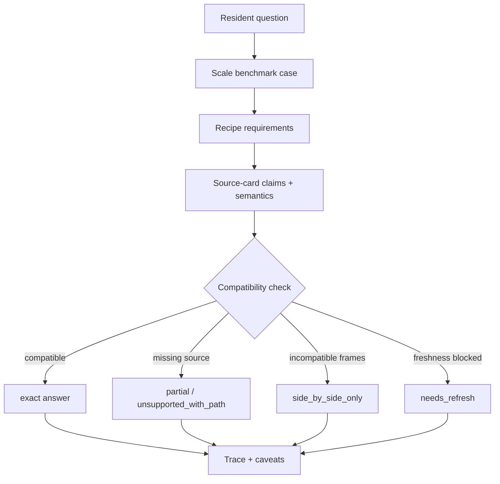

# feat: Safe composition roadmap

## Summary

This plan turns the Scale benchmark and Oracle review into six implementation milestones. The first three milestones make Civic Agent safer at composing existing source-backed answers; the last three use that machinery to add population denominators and King County biennial context without collapsing incompatible budget frames.

---

## Problem Frame

Civic Agent already performs well when a question maps to one validated source with a clear measure, grain, and trace. The Scale benchmark exposed the next product gap: resident-facing questions such as budget size, growth, and per-resident comparisons require source composition across budget frames, periods, and denominators. The roadmap should improve composition safety without creating a universal civic database schema, broad benchmark automation, or contributor machinery before the repo has enough source diversity to justify it.

The plan uses the Oracle recommendation as the sequencing spine: benchmark contract first, minimal source semantics second, prompt-level recipes and planner third, population denominator source fourth and fifth, and King County adopted/biennial context sixth.

---

## Requirements

- R1. The repo must gain a checked-in Scale benchmark contract that can be rerun manually and used to judge future source PRs.
- R2. Benchmark cases must record expected source ids, required caveats, score dimensions, failure modes, and improvement paths without requiring automated model evaluation.
- R3. Source-card metadata must expose enough semantic compatibility information to distinguish supported local claims from safe cross-source comparisons.
- R4. The first semantic compatibility vocabulary must stay minimal and source-card-scoped; it must not become a normalized civic database schema.
- R5. The router and packaged plugin references must teach Scale recipes and answer modes so installed Civic Agent behavior changes, not just documentation.
- R6. Composed answers must choose an answer mode such as exact, partial, side-by-side only, unsupported with path, or needs refresh before presenting numeric comparisons.
- R7. Population must enter as the first companion context source family through the same probe, storage, fingerprint, validation, and caveat discipline as budget sources.
- R8. Per-capita answers must state denominator source, estimate date, jurisdiction boundary, and fiscal-year mismatch instead of treating population as an implicit constant.
- R9. King County adopted/biennial budget context must be presented beside annual dashboard budgeted expenditure, not used as a replacement for it.
- R10. Every new source added after the benchmark contract must include at least one benchmark case or benchmark update that proves the resident-facing question it improves.

---

## Key Technical Decisions

- **Benchmark before framework:** Start with checked-in benchmark cases and a manual auditor template so later recipe and metadata decisions are tied to concrete regression targets.
- **Metadata as compatibility hints:** Add semantic compatibility fields to source cards or `coverage_claims`, not to a global normalized data model. Source cards remain the source of truth.
- **Prompt-level planner first:** Teach the router and jurisdiction references to plan composed answers before building a code planner. This fits the current plugin architecture and keeps implementation small.
- **Population as source-family proof:** Treat OFM population as the first denominator-source pattern, not a Seattle-only patch. This proves companion context onboarding before broader demographics coverage.
- **Context source for King County biennium:** Add the adopted/biennial page as context-only or a narrow snapshot unless implementation finds a stable extractable table. The recipe must keep annual dashboard and biennial adopted figures separate.
- **Coverage matrix stays documentation:** Do not turn `docs/coverage-matrix.md` into an answering engine or a comparability score. It can display source-level semantics later only if doing so remains documentation.

---

## High-Level Technical Design

Milestones should preserve this flow. Benchmark cases define what good looks like, source cards declare what each source can safely support, recipes describe how resident-facing questions compose claims, and the planner chooses the answer mode before numbers are compared.

---

## Milestone Roadmap

| Milestone | Goal | Primary PR outcome |
|---|---|---|
| M1 | Scale benchmark contract | Future work has a checked-in regression target and manual scoring rubric. |
| M2 | Semantic compatibility metadata v0 | Seattle, King County, and Washington source claims expose minimal comparison semantics. |
| M3 | Scale recipes and prompt-level planner | Router and packaged plugin references can classify composed answers before responding. |
| M4 | Population denominator probe | OFM population is evaluated as a companion context source family. |
| M5 | Population source acceptance | Per-capita benchmark moves from unsupported to source-backed partial or exact answer mode. |
| M6 | King County biennial context | King County budget-size answer safely shows annual dashboard and adopted biennial frames side by side. |

---

## Implementation Units

### U1. M1 - Scale Benchmark Contract

- **Goal:** Add a checked-in benchmark suite for the four Scale questions and make it usable as the acceptance target for later milestones.
- **Requirements:** R1, R2, R10
- **Dependencies:** None
- **Files:**
  - `benchmarks/scale/README.md`
  - `benchmarks/scale/cases.json`
  - `benchmarks/scale/manual-audit-template.md`
  - `benchmarks/scale/2026-06-06-baseline.md`
  - `tests/test_benchmark_contract.py`
  - `README.md`
- **Approach:** Define a compact benchmark case shape with stable ids, question text, recipe placeholder, jurisdictions, expected source ids, required caveats, score dimensions, expected failure mode, and improvement path. Include the June 6 baseline as historical evidence, but make `cases.json` the forward-looking contract. Keep the runner manual; tests should validate schema, ids, score dimensions, source ids that currently exist, and required caveat fields.
- **Patterns to follow:** Source-card tests in `tests/test_source_coverage.py`; storage-policy vocabulary tests in `tests/test_source_storage_policy.py`; documentation style in `docs/source-probing.md`.
- **Test scenarios:**
  - Happy path: loading `benchmarks/scale/cases.json` finds exactly the four seed Scale cases with unique ids and non-empty questions.
  - Happy path: every case declares the standard score dimensions: correctness, traceability, coverage awareness, comparability, civic usefulness, freshness, and improvement path.
  - Happy path: expected source ids that are already accepted resolve to checked-in source cards under `jurisdictions/*/sources/`.
  - Edge case: a case missing required caveats, failure mode, or improvement path fails validation with a clear assertion.
  - Edge case: a duplicate case id fails validation.
  - Integration: `README.md` points maintainers to the benchmark suite without presenting it as automated model evaluation.
- **Verification:** A reviewer can open `benchmarks/scale/README.md`, understand how to rerun the benchmark manually, and see which later source or recipe changes should update the cases.

### U2. M2 - Semantic Compatibility Metadata v0

- **Goal:** Add minimal source-card semantics needed by Scale recipes without turning source cards into a universal schema.
- **Requirements:** R3, R4, R6
- **Dependencies:** U1
- **Files:**
  - `docs/coverage-taxonomy.md`
  - `docs/architecture.md`
  - `jurisdictions/seattle/sources/operating-budget.source.json`
  - `jurisdictions/king_county/sources/open-budget-dashboard.source.json`
  - `jurisdictions/washington/sources/operating-budget.source.json`
  - `jurisdictions/washington/sources/revenue-by-biennium.source.json`
  - `jurisdictions/washington/sources/open-checkbook.source.json`
  - `scripts/coverage.py`
  - `tests/test_source_coverage.py`
  - `docs/coverage-matrix.md`
- **Approach:** Add a `semantics` or `composition_metadata` block to supported and partial claims. Start with `amount_basis`, `budget_frame`, `period_type`, `period_status`, `unit`, `government_scope`, `geography_basis`, and `comparability_notes`. Only add `service_scope` or `nominal_or_adjusted` when a current claim needs the field. Keep unsupported claims source-scoped and do not require semantics for unsupported rows.
- **Patterns to follow:** Existing `coverage_claims` shape in source cards; generated documentation pattern in `scripts/coverage.py`; active/backlog category discipline in `docs/coverage-taxonomy.md`.
- **Test scenarios:**
  - Happy path: supported and partial claims for current accepted sources include required semantic fields.
  - Happy path: unsupported claims remain valid without semantic fields and still use source-level wording.
  - Edge case: an unknown semantic field value for the v0 vocabulary fails validation.
  - Edge case: source-card semantics do not imply jurisdiction-level comparability in `docs/coverage-matrix.md`.
  - Integration: regenerating `docs/coverage-matrix.md` preserves current source coverage rows and adds only reviewable semantic/comparability text if useful.
- **Verification:** Existing coverage tests pass, and a reviewer can tell why Seattle `approved_amount`, King County `budgeted_expenditure`, and Washington `budgeted_amount` are not automatically comparable.

### U3. M3 - Scale Recipes and Prompt-Level Planner

- **Goal:** Teach Civic Agent to route composed Scale questions through recipes and answer modes before presenting numbers.
- **Requirements:** R5, R6
- **Dependencies:** U1, U2
- **Files:**
  - `docs/recipes/scale.md`
  - `skill.md`
  - `skills/civic-agent/SKILL.md`
  - `jurisdictions/seattle/skill.md`
  - `jurisdictions/king_county/skill.md`
  - `jurisdictions/washington/skill.md`
  - `plugins/civic-agent/skills/civic-agent/SKILL.md`
  - `plugins/civic-agent/skills/civic-agent/references/seattle.md`
  - `plugins/civic-agent/skills/civic-agent/references/king_county.md`
  - `plugins/civic-agent/skills/civic-agent/references/washington.md`
  - `tests/test_dev_workflow.py`
- **Approach:** Add recipe docs for `budget_scale.current_total`, `budget_scale.trend`, `budget_scale.per_capita`, and `budget_scale.cross_jurisdiction`. Add router language for the planning sequence: question, recipe, required claims, available sources, compatibility check, answer mode. Define answer modes as exact, partial, side-by-side only, unsupported with path, and needs refresh. Refresh packaged references through the existing packaging path rather than editing generated plugin files by hand.
- **Patterns to follow:** Router contract in `skill.md`; compact trace shape in jurisdiction skills; package drift checks in `scripts/package_plugin.py` and `tests/test_dev_workflow.py`.
- **Test scenarios:**
  - Happy path: router and packaged skill mention Scale recipes and answer modes.
  - Happy path: jurisdiction references generated under `plugins/civic-agent/skills/civic-agent/references/` match canonical jurisdiction skills after packaging.
  - Edge case: the King County skill continues to prohibit direct cross-jurisdiction numeric comparison unless recipe compatibility is established.
  - Edge case: per-capita recipe says unsupported with path when no denominator source exists.
  - Integration: `python3 scripts/package_plugin.py --check` remains clean after canonical skill changes.
- **Verification:** A fresh installed plugin has the same recipe/planner guidance as the canonical router and jurisdiction skills.

### U4. M4 - Population Denominator Source Probe

- **Goal:** Evaluate official population estimates as the first companion context source family.
- **Requirements:** R7, R8, R10
- **Dependencies:** U1, U3
- **Files:**
  - `docs/source-probes/washington-ofm-population.md`
  - `docs/coverage-taxonomy.md`
  - `benchmarks/scale/cases.json`
  - `benchmarks/scale/README.md`
- **Approach:** Probe Washington OFM April 1 official population estimates for Seattle and King County denominator use. Record official owner, public inspection URL, machine or file access path, geography coverage, estimate dates, row identifiers, validation checks, caveats, and storage-tier recommendation. Keep this as a probe first; do not promote broad demographics coverage or accept the source in the same milestone unless implementation discovery shows the source path is trivial and reviewable.
- **Patterns to follow:** `docs/source-probing.md`; `docs/templates/source-probe-brief.md`; Washington source-probe docs under `docs/source-probes/`.
- **Test scenarios:**
  - Test expectation: none for the probe document itself; the reviewable outcome is the source-probe artifact.
  - Integration: the Scale benchmark per-capita case links the missing denominator path to the probe without treating the source as accepted.
- **Verification:** A maintainer can decide from the probe whether OFM population should be accepted live, snapshotted, context-only, watched, or rejected.

### U5. M5 - Population Source Acceptance and Per-Capita Wiring

- **Goal:** Accept the first population denominator source and use it to improve the per-capita Scale benchmark.
- **Requirements:** R7, R8, R10
- **Dependencies:** U2, U3, U4
- **Files:**
  - `jurisdictions/washington/sources/ofm-population.source.json`
  - `jurisdictions/washington/data/ofm-population/`
  - `jurisdictions/washington/scripts/extract_ofm_population.py`
  - `jurisdictions/washington/skill.md`
  - `jurisdictions/seattle/skill.md`
  - `jurisdictions/king_county/skill.md`
  - `docs/coverage-taxonomy.md`
  - `docs/coverage-matrix.md`
  - `benchmarks/scale/cases.json`
  - `tests/test_source_storage_policy.py`
  - `tests/test_source_data_validation.py`
  - `tests/test_source_coverage.py`
  - `tests/test_washington_ofm_population_extract.py`
- **Approach:** Add the source card and extraction path selected by U4. If the official workbook or file is compact and slow-changing, prefer a checked-in normalized snapshot with summary and provenance. Wire the per-capita recipe to state denominator source, estimate date, resident jurisdiction boundary, and mismatch between FY2026 budgets and the April 1 population estimate. Promote only the narrow denominator category needed by the recipe; defer broad demographics coverage.
- **Patterns to follow:** Checked-in snapshot pattern for King County and Washington operating budget; validation result shape in `docs/source-data-validation.md`; extractor tests such as `tests/test_washington_powerbi_extract.py` and `tests/test_washington_revenue_extract.py`.
- **Test scenarios:**
  - Happy path: extractor produces normalized population rows for Seattle and King County with stable identifiers, estimate date, and population value.
  - Happy path: source validation passes offline and exposes source fingerprint, row counts, and named checks.
  - Happy path: per-capita benchmark expected source ids include the accepted population source.
  - Edge case: if the population file omits either Seattle or King County, validation fails rather than producing partial denominators silently.
  - Edge case: unsupported demographic claims remain unsupported; accepting population for denominators does not imply broad demographics coverage.
  - Integration: Seattle and King County skill guidance can answer per-capita with denominator caveats and without comparing service scope as if it were identical.
- **Verification:** The per-capita benchmark can be answered as source-backed partial or exact, with traceable denominator evidence.

### U6. M6 - King County Adopted/Biennial Budget Context

- **Goal:** Add official King County adopted/biennial budget context and make the budget-size answer safer.
- **Requirements:** R6, R9, R10
- **Dependencies:** U1, U2, U3
- **Files:**
  - `docs/source-probes/king-county-adopted-budget.md`
  - `jurisdictions/king_county/sources/adopted-budget.source.json`
  - `jurisdictions/king_county/data/adopted-budget/`
  - `jurisdictions/king_county/skill.md`
  - `docs/king-county-demo.md`
  - `benchmarks/scale/cases.json`
  - `tests/test_source_storage_policy.py`
  - `tests/test_source_data_validation.py`
  - `tests/test_source_coverage.py`
  - `tests/test_king_county_adopted_budget_source.py`
- **Approach:** Probe the official adopted budget page first. If it provides a stable extractable table or document total, add a context-only or checked-in snapshot source. Update the King County skill and current-total recipe so answers present FY2026 dashboard budgeted expenditure and the 2026-2027 adopted biennial budget side by side, with clear period and budget-frame caveats.
- **Patterns to follow:** Context-only/watchlist/reject tier language in `docs/source-data-storage.md`; source-probe first rule in `docs/source-probing.md`; King County snapshot caveats in `jurisdictions/king_county/skill.md`.
- **Test scenarios:**
  - Happy path: source card records official public URL, storage policy, source fingerprint, and unsupported claims.
  - Happy path: benchmark case for King County current total expects side-by-side treatment rather than one winning number.
  - Edge case: if the adopted budget source remains context-only, normal answers cite it as framing context and do not compute unsupported drill-downs.
  - Edge case: annual dashboard years and biennial adopted periods are not marked composition-ready with each other.
  - Integration: King County skill answer style explains the difference between dashboard budgeted expenditure and adopted biennial budget before giving numbers.
- **Verification:** The King County budget-size benchmark no longer loses to web search on headline framing, while preserving annual dashboard traceability.

---

## Scope Boundaries

### In Scope

- Manual benchmark contract and validation tests for benchmark metadata.
- Minimal source-card semantic compatibility metadata for accepted source claims.
- Prompt/skill-level Scale recipes and answer modes.
- First companion denominator source pattern through population.
- King County adopted/biennial context for the benchmark failure.

### Deferred to Follow-Up Work

- Automated model-running benchmark harness.
- Hosted artifact support for nationwide source volume.
- Inflation, households, service population, geography boundary, service demand, and responsibility-map source families.
- Formal source-intake templates or broad `CONTRIBUTING.md`.
- `scripts/new_jurisdiction.py` or adapter scaffolding.
- Coverage-matrix composition statuses beyond source-card documentation.

### Outside This Product's Identity

- Treating web search as a silent fallback source of truth when accepted source cards are missing.
- Claiming full jurisdiction coverage from one reviewed source.
- Normalizing all city, county, state, and federal civic data into one universal database schema before source diversity forces it.

---

## System-Wide Impact

The first three milestones affect the plugin's core answer contract: source cards, benchmark docs, router skills, packaged references, and coverage documentation. The later milestones affect source onboarding and snapshot validation. Every milestone that changes canonical router or jurisdiction skills must keep the packaged plugin current so production and dev installs do not drift from repo behavior.

---

## Risks & Dependencies

- **Benchmark cases become stale:** Mitigate by treating `benchmarks/scale/cases.json` as the forward contract and baseline markdown as historical evidence.
- **Semantic metadata expands into a schema:** Mitigate by requiring each v0 field to serve an active benchmark or accepted source claim.
- **Planner remains prose only:** Mitigate with benchmark cases that require answer modes and caveats, plus packaged-router checks.
- **Population source overclaims demographics coverage:** Mitigate by accepting only denominator use until a separate demographics probe promotes broader categories.
- **King County adopted budget source is document-shaped:** Mitigate by using `context_only` or a narrow snapshot rather than forcing unsupported extraction.

---

## Sources & Research

- `benchmarks/scale/` planned from the June 6 Scale benchmark artifacts and Oracle Pro review.
- `docs/coverage-taxonomy.md` and `docs/coverage-matrix.md` define source-scoped coverage claims and non-score rollups.
- `docs/source-probing.md`, `docs/source-data-storage.md`, and `docs/source-data-validation.md` define source acceptance, storage, fingerprint, and validation expectations.
- `skill.md` and `jurisdictions/*/skill.md` define current router and jurisdiction answer behavior.
- `tests/test_source_coverage.py`, `tests/test_source_storage_policy.py`, and `tests/test_source_data_validation.py` are the closest patterns for metadata validation.
- `docs/brainstorms/2026-06-04-contribution-workflow-requirements.md` remains a guardrail against premature contributor machinery and universal schema work.
